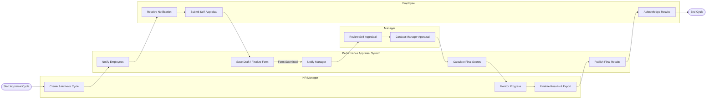

# Swimlane Diagram — Performance Appraisal System

## Mermaid Code

## Flow Description | Mo ta luong

| Lane | Actor | Role in Flow |
|------|-------|-------------|
| 1 | HR Manager | Nguoi khoi tao ky danh gia, theo doi tien do chung va chot ket qua cuoi cung. |
| 2 | Performance Appraisal System | He thong xu ly logic, luu tru du lieu, tinh toan diem so va gui thong bao tu dong. |
| 3 | Employee | Nhan vien thuc hien viec tu danh gia tren he thong va xac nhan ket qua cuoi cung. |
| 4 | Manager | Quan ly truc tiep xem xet phieu tu danh gia va cham diem, dua ra nhan xet cho nhan vien. |
