# Action Tree — Performance Appraisal System

## Mermaid Code

```mermaid
%%{init: {'theme': 'default'}}%%
graph TD
    Root["Performance Appraisal System"]

    Root --> M1["Goal Management"]
    Root --> M2["Appraisal Cycle Management"]
    Root --> M3["Evaluation & Scoring"]
    Root --> M4["Reports & Analytics"]
    Root --> M5["System Administration"]

    M1 --> A11["Set Individual Goals"]
    M1 --> A12["Update Goal Progress"]
    M1 --> A13["Align Goals with Team"]

    M2 --> A21["Create Appraisal Cycle"]
    M2 --> A22["Manage Evaluation Templates"]
    M2 --> A23["Monitor Cycle Status"]

    M3 --> A31["Submit Self-Appraisal"]
    M3 --> A32["Conduct Manager Appraisal"]
    M3 --> A33["Acknowledge Results"]
    M3 --> A34["Submit Appeal Request"]

    M4 --> A41["View Team Performance"]
    M4 --> A42["Generate Organization Report"]
    M4 --> A43["Export Appraisal Data"]

    M5 --> A51["Manage Users & Roles"]
    M5 --> A52["Configure System Settings"]
    M5 --> A53["View System Logs"]
```

## Module Description | Mo ta Module

| # | Module | Description | Actions |
|---|--------|-------------|---------|
| 1 | Goal Management | Quan ly qua trinh thiet lap va cap nhat muc tieu | Set Individual Goals, Update Goal Progress, Align Goals with Team |
| 2 | Appraisal Cycle Management | Cau hinh va theo doi cac ky danh gia dinh ky | Create Appraisal Cycle, Manage Evaluation Templates, Monitor Cycle Status |
| 3 | Evaluation & Scoring | Thuc hien viec cham diem va nhan xet chi tiet | Submit Self-Appraisal, Conduct Manager Appraisal, Acknowledge Results, Submit Appeal Request |
| 4 | Reports & Analytics | Thong ke va phan tich ket qua hieu suat | View Team Performance, Generate Organization Report, Export Appraisal Data |
| 5 | System Administration | Quan tri tai khoan va cac thiet lap he thong | Manage Users & Roles, Configure System Settings, View System Logs |
