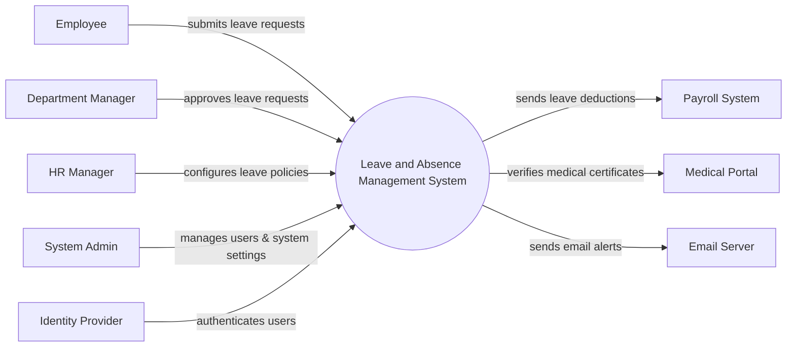

# Context Diagram — Leave and Absence Management System

## Mermaid Code

## Actor & Interaction Table | Bang Actor & Tuong tac

| # | Actor | Actor Type | Data Sent TO System | Data Received FROM System | Notes |
|---|-------|------------|---------------------|---------------------------|-------|
| 1 | Employee | Primary | Leave requests, medical documents | Leave balance, approval status | Nhan vien thong thuong |
| 2 | Department Manager | Primary | Leave approvals, rejections | Team leave calendar, notifications | Quan ly bo phan |
| 3 | HR Manager | Primary | Leave policies, manual adjustments | Absence reports, leave statistics | Nhan su chuyen trach |
| 4 | System Admin | Primary | User roles, system configurations | System logs, audit reports | Quan tri he thong |
| 5 | Payroll System | Supporting | Payroll sync confirmation | Unpaid leave deductions | He thong tinh luong |
| 6 | Medical Portal | Supporting | Verification status | Medical certificate data | Cong y te xac thuc |
| 7 | Email Server | Supporting | Email delivery status | Notification contents | He thong gui email |
| 8 | Identity Provider | Supporting | Authentication tokens | Login credentials | He thong SSO |

## System Boundary Description | Mo ta Pham vi He thong

The Leave and Absence Management System is responsible for managing employee time-off, including leave requests, approvals, and balance tracking. It serves as the central platform for Employees, Managers, and HR to handle absences based on company policies. The system does not directly process payroll calculations but sends unpaid leave data to the Payroll System. It integrates with external Email Servers for notifications, Identity Providers for authentication, and Medical Portals for verifying sick leave documents.
