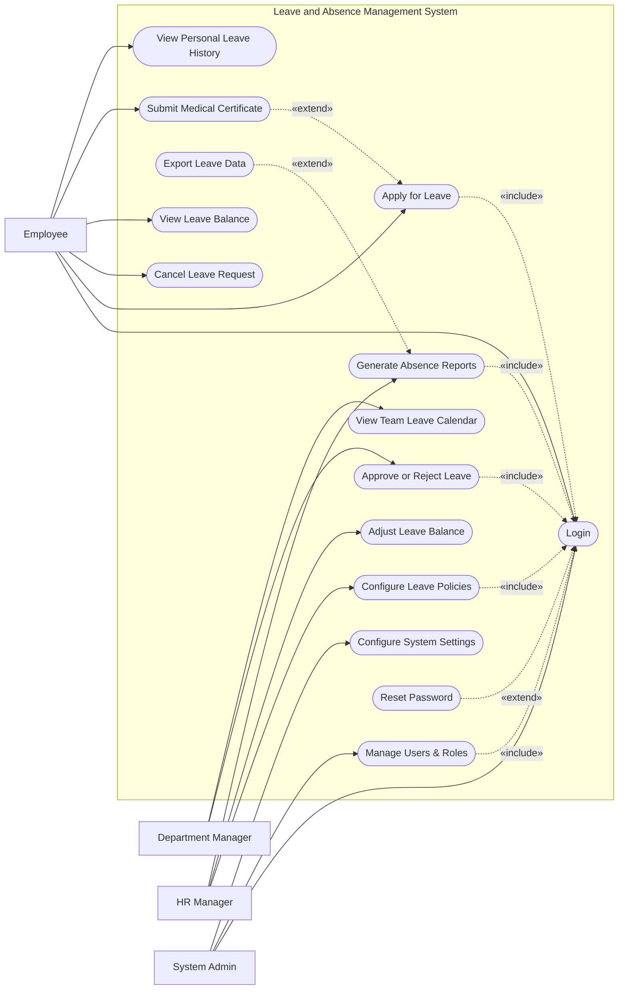

# Use Case Diagram — Leave and Absence Management System

## Mermaid Code

## Actor Table | Bang Actor

| # | Actor | Actor Type | Role Description | Related Use Cases |
|---|-------|------------|------------------|-------------------|
| 1 | Employee | Primary | Nhan vien thong thuong nop don xin nghi | UC01, UC02, UC03, UC04, UC11, UC15 |
| 2 | Department Manager | Primary | Nguoi quan ly phe duyet don xin nghi cua nhan vien | UC05, UC06 |
| 3 | HR Manager | Primary | Nhan su thiet lap chinh sach va giam sat | UC07, UC08, UC09, UC10 |
| 4 | System Admin | Primary | Quan tri vien he thong, phan quyen va cai dat | UC01, UC12, UC13 |

## Use Case Table | Bang Use Case

| # | UC ID | Use Case Name | Primary Actor | Secondary Actor | Description | Priority |
|---|-------|---------------|---------------|-----------------|-------------|----------|
| 1 | UC01 | Login | Employee | | Authenticate user access | High |
| 2 | UC02 | Apply for Leave | Employee | | Submit a request for time off | High |
| 3 | UC03 | Cancel Leave Request | Employee | | Cancel a pending or approved leave | Medium |
| 4 | UC04 | View Leave Balance | Employee | | Check remaining leave days | High |
| 5 | UC05 | Approve or Reject Leave | Department Manager | | Review and process leave requests | High |
| 6 | UC06 | View Team Leave Calendar | Department Manager | | View leave schedules of the team | Medium |
| 7 | UC07 | Configure Leave Policies | HR Manager | | Set rules for different leave types | High |
| 8 | UC08 | Adjust Leave Balance | HR Manager | | Manually modify employee leave limits | Medium |
| 9 | UC09 | Generate Absence Reports | HR Manager | | Create statistical absence reports | Medium |
| 10| UC10 | Export Leave Data | HR Manager | | Download reports as files | Low |
| 11| UC11 | Submit Medical Certificate | Employee | Medical Portal | Upload proof for sick leave | Medium |
| 12| UC12 | Manage Users & Roles | System Admin | | Create, update, or deactivate user accounts | High |
| 13| UC13 | Configure System Settings | System Admin | | Update system-wide preferences | Medium |
| 14| UC14 | Reset Password | Employee | | Recover account access | High |
| 15| UC15 | View Personal Leave History| Employee | | View past leave applications | Low |

## Use Case Specification | Dac ta Use Case

---

### UC01 — Login

| Field | Detail |
|-------|--------|
| **UC ID** | UC01 |
| **Use Case Name** | Login |
| **Actor(s)** | Primary: Employee, Department Manager, HR Manager, System Admin |
| **Description** | Cho phep nguoi dung xac thuc de dang nhap vao he thong. |
| **Precondition** | 1. Nguoi dung phai co tai khoan hop le tren he thong.  2. He thong dang hoat dong binh thuong. |
| **Main Flow** | 1. Actor mo trang dang nhap.  2. System hien thi form dang nhap.  3. Actor nhap username va password.  4. Actor nhan nut Submit.  5. System xac thuc qua SSO.  6. System chuyen huong den trang chu tuong ung quyen han. |
| **Alternative Flow** | **AF1** — Quen mat khau: Neu Actor chon "Forgot Password", System kich hoat UC14 Reset Password. |
| **Exception Flow** | **EX1** — Sai thong tin: Neu xac thuc that bai, System hien thi thong bao loi va yeu cau nhap lai.  **EX2** — Tai khoan bi khoa: Neu nhap sai qua 5 lan, System khoa tai khoan va thong bao lien he Admin. |
| **Postcondition** | Nguoi dung duoc dang nhap va phien lam viec duoc khoi tao. |
| **Business Rule** | **BR1**: Mat khau phai duoc ma hoa.  **BR2**: Phien dang nhap tu dong het han sau 30 phut khong hoat dong. |

---

### UC02 — Apply for Leave

| Field | Detail |
|-------|--------|
| **UC ID** | UC02 |
| **Use Case Name** | Apply for Leave |
| **Actor(s)** | Primary: Employee |
| **Description** | Cho phep nhan vien nop don xin nghi phep. |
| **Precondition** | 1. Nhan vien da dang nhap (Include UC01).  2. Nhan vien con du so ngay phep cho loai phep yeu cau. |
| **Main Flow** | 1. Actor chon chuc nang "Apply Leave".  2. System hien thi so phep con lai va form dang ky.  3. Actor chon loai phep, chon ngay bat dau/ket thuc va nhap ly do.  4. Actor nhan Submit.  5. System kiem tra tinh hop le cua don.  6. System luu don va gui email thong bao den Department Manager. |
| **Alternative Flow** | **AF1** — Tai lieu y te (Extend UC11): Neu chon phep om >= 3 ngay, System yeu cau tai len giay kham benh truoc khi luu. |
| **Exception Flow** | **EX1** — Khong du phep: Neu so ngay chon vuot qua so phep con lai, System hien thi loi va chan Submit.  **EX2** — Trung lich: Neu ngay xin nghi trung voi don da nop truoc do, System thong bao loi. |
| **Postcondition** | Don xin nghi phep luu o trang thai "Pending" va thong bao duoc gui cho quan ly. |
| **Business Rule** | **BR1**: Xin nghi phep nam (Annual Leave) tren 3 ngay phai nop don truoc it nhat 7 ngay.  **BR2**: Ngay le khong tinh vao so ngay phep. |

---

### UC05 — Approve or Reject Leave

| Field | Detail |
|-------|--------|
| **UC ID** | UC05 |
| **Use Case Name** | Approve or Reject Leave |
| **Actor(s)** | Primary: Department Manager |
| **Description** | Quan ly phong ban xem xet va phe duyet/tu choi don xin nghi phep cua nhan vien. |
| **Precondition** | 1. Manager da dang nhap (Include UC01).  2. Co it nhat 1 don nghi phep dang cho duyet (Pending). |
| **Main Flow** | 1. Actor vao man hinh "Leave Requests".  2. System hien thi danh sach don dang cho.  3. Actor chon xem chi tiet mot don.  4. System hien thi chi tiet don va lich nghi cua team (UC06).  5. Actor nhan "Approve" (Dong y).  6. System cap nhat trang thai don, tru ngay phep cua nhan vien va gui thong bao. |
| **Alternative Flow** | **AF1** — Tu choi: O buoc 5, Actor chon "Reject" va bat buoc nhap ly do. System cap nhat trang thai "Rejected" va gui thong bao. |
| **Exception Flow** | **EX1** — Don da xu ly: Neu don da bi huy hoac duyet boi nguoi khac, System hien thi loi "Request already processed" va tai lai trang. |
| **Postcondition** | Trang thai don chuyen thanh "Approved" hoac "Rejected", va so luong phep duoc cap nhat (neu duyet). |
| **Business Rule** | **BR1**: Manager chi xem duoc va duyet don cua nhan vien trong phong ban minh.  **BR2**: Don xin nghi dac biet (Thai san, Khong luong) co the can them phe duyet cua HR Manager. |

---

### UC08 — Adjust Leave Balance

| Field | Detail |
|-------|--------|
| **UC ID** | UC08 |
| **Use Case Name** | Adjust Leave Balance |
| **Actor(s)** | Primary: HR Manager |
| **Description** | HR Manager dieu chinh thu cong so ngay phep cua nhan vien trong cac truong hop dac biet. |
| **Precondition** | 1. HR Manager da dang nhap (Include UC01).  2. Tai khoan co quyen thuc hien dieu chinh (Adjust Balance Permission). |
| **Main Flow** | 1. Actor tim kiem va chon nhan vien tren he thong.  2. System hien thi chi tiet quy phep hien tai cua nhan vien.  3. Actor chon "Adjust Balance".  4. Actor nhap so ngay thay doi (tang/giam) va ghi ro ly do.  5. Actor nhan "Save".  6. System cap nhat so du, luu vet dieu chinh vao audit log va thong bao cho nhan vien. |
| **Alternative Flow** | **AF1** — Huy bo: Truoc khi luu, Actor chon "Cancel", System quay lai trang thong tin phep. |
| **Exception Flow** | **EX1** — So du am: Neu dieu chinh giam lam cho so phep hien tai < 0, System hien thi canh bao (van co the cho phep neu chinh sach cho phep no phep). |
| **Postcondition** | Quy phep cua nhan vien duoc cap nhat va luu vao lich su (audit log). |
| **Business Rule** | **BR1**: Moi hanh dong dieu chinh phai co ly do ro rang va duoc ghi nhan trong he thong de audit.  **BR2**: Viec cong/tru phep chi thuc hien o ky ke toan hien tai. |

---

### UC12 — Manage Users & Roles

| Field | Detail |
|-------|--------|
| **UC ID** | UC12 |
| **Use Case Name** | Manage Users & Roles |
| **Actor(s)** | Primary: System Admin |
| **Description** | Admin tao moi, cap nhat, xoa hoac phan quyen cho nguoi dung he thong. |
| **Precondition** | 1. Admin da dang nhap (Include UC01).  2. Admin vao muc User Management. |
| **Main Flow** | 1. Actor chon "Create User".  2. System hien thi form tao nguoi dung.  3. Actor nhap thong tin nhan vien va chon vai tro (Employee, Manager, HR).  4. Actor nhan "Submit".  5. System kiem tra tinh duy nhat cua email/username.  6. System tao tai khoan, gui email kich hoat va cap nhat danh sach. |
| **Alternative Flow** | **AF1** — Sua tai khoan: Actor chon sua user da ton tai, thay doi thong tin/quyen va luu. |
| **Exception Flow** | **EX1** — Trung email: Neu email da ton tai, System bao loi "Email already registered".  **EX2** — Xoa Admin cuoi cung: Neu co gang xoa Admin duy nhat, System chan lai va bao loi. |
| **Postcondition** | Thong tin nguoi dung hoac quyen duoc tao moi/cap nhat thanh cong tren he thong. |
| **Business Rule** | **BR1**: Moi email chi tuong ung voi 1 tai khoan dang nhap.  **BR2**: Nhan vien nghi viec se bi doi trang thai tai khoan sang Inactive thay vi xoa hoan toan du lieu. |
