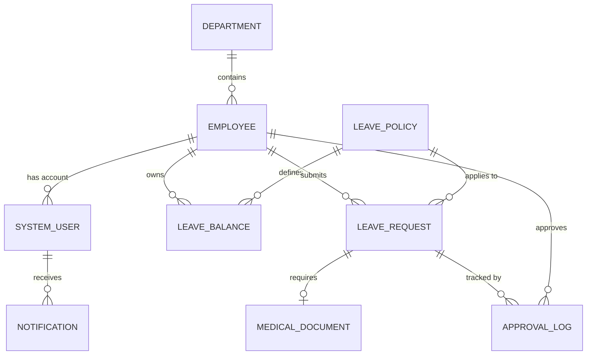

# Conceptual ERD — Leave and Absence Management System
## Mermaid Code

## Entity Description Table | Bang mo ta Entity
| # | Entity Name | Vietnamese Name | Description | Key Attributes | Main Relationships |
|---|-------------|-----------------|-------------|----------------|-------------------|
| 1 | DEPARTMENT | Phong ban | Thong tin cac phong ban | department_id, department_name | contains EMPLOYEE |
| 2 | EMPLOYEE | Nhan vien | Ho so nhan su co ban | employee_id, full_name, email | belongs to DEPARTMENT |
| 3 | SYSTEM_USER| Nguoi dung HT | Tai khoan dang nhap he thong | user_id, role, status | belongs to EMPLOYEE |
| 4 | LEAVE_POLICY | Chinh sach phep | Dinh nghia cac loai nghi phep | policy_id, name, max_days | defines LEAVE_BALANCE |
| 5 | LEAVE_BALANCE| Quy phep | So ngay phep hien tai cua NV | balance_id, remaining_days | belongs to EMPLOYEE |
| 6 | LEAVE_REQUEST| Don xin nghi | Yeu cau nghi phep cua NV | request_id, dates, status | belongs to EMPLOYEE |
| 7 | MEDICAL_DOCUMENT | Ho so y te | Giay xac nhan kham benh | document_id, file_url | belongs to LEAVE_REQUEST |
| 8 | APPROVAL_LOG | Nhat ky duyet | Vet lich su duyet don | log_id, action, comment | belongs to LEAVE_REQUEST |
| 9 | HOLIDAY | Ngay le | Danh sach ngay nghi le chung | holiday_id, name, date | N/A |
| 10| NOTIFICATION | Thong bao | Thong bao gui qua he thong | notification_id, message | belongs to SYSTEM_USER |
## Relationship Description | Mo ta Quan he
| # | From Entity | Cardinality | To Entity | Relationship Label | Business Explanation |
|---|-------------|-------------|-----------|-------------------|----------------------|
| 1 | DEPARTMENT | one-to-many | EMPLOYEE | contains | Mot phong ban bao gom nhieu nhan vien. |
| 2 | EMPLOYEE | one-to-many | SYSTEM_USER | has account | Mot nhan vien co the co nhieu tai khoan dang nhap (hoac quyen). |
| 3 | EMPLOYEE | one-to-many | LEAVE_BALANCE | owns | Mot nhan vien so huu nhieu quy phep (theo nam/loai). |
| 4 | LEAVE_POLICY | one-to-many | LEAVE_BALANCE | defines | Mot chinh sach ap dung cho nhieu bang quy phep. |
| 5 | EMPLOYEE | one-to-many | LEAVE_REQUEST | submits | Mot nhan vien co the nop nhieu don xin nghi phep. |
| 6 | LEAVE_POLICY | one-to-many | LEAVE_REQUEST | applies to | Mot chinh sach duoc ap dung vao nhieu don xin nghi. |
| 7 | LEAVE_REQUEST| one-to-one | MEDICAL_DOCUMENT | requires | Mot don nghi phep (om) co the yeu cau mot tai lieu y te. |
| 8 | LEAVE_REQUEST| one-to-many | APPROVAL_LOG | tracked by | Mot don nghi phep duoc luu vet qua nhieu buoc duyet. |
| 9 | EMPLOYEE | one-to-many | APPROVAL_LOG | approves | Mot quan ly (nhan vien) co the duyet nhieu don. |
| 10| SYSTEM_USER | one-to-many | NOTIFICATION | receives | Mot nguoi dung nhan nhieu thong bao he thong. |

