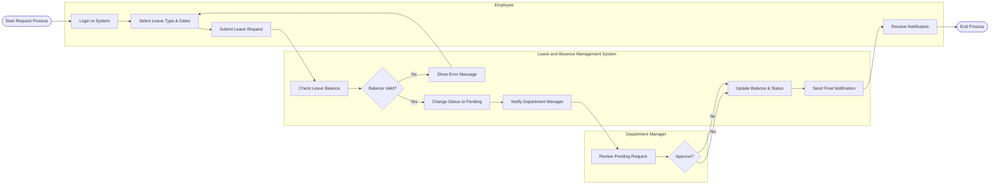

# Swimlane Diagram — Leave and Absence Management System

## Mermaid Code

## Flow Description | Mo ta luong

| Lane | Actor | Role in Flow |
|------|-------|-------------|
| 1 | Employee | Nguoi chu dong chon ngay, loai phep de nop don va nhan thong bao ket qua cuoi cung. |
| 2 | Leave and Absence Management System | He thong kiem tra quy phep hop le, quan ly trang thai, tru phep khi duyet va gui thong bao. |
| 3 | Department Manager | Nguoi quan ly nhan thong bao, xem xet li do va dua ra quyet dinh phe duyet hoac tu choi. |
