# Action Tree — Leave and Absence Management System

## Mermaid Code

```mermaid
%%{init: {'theme': 'default'}}%%
graph TD
    Root["Leave and Absence Management System"]

    Root --> M1["Request Management"]
    Root --> M2["Approval Management"]
    Root --> M3["Policy Management"]
    Root --> M4["Balance & Reporting"]
    Root --> M5["System Administration"]

    M1 --> A11["Apply for Leave"]
    M1 --> A12["Cancel Leave Request"]
    M1 --> A13["Upload Medical Doc"]
    M1 --> A14["View Leave History"]

    M2 --> A21["Approve Leave Requests"]
    M2 --> A22["Reject Leave Requests"]
    M2 --> A23["View Team Leave Calendar"]

    M3 --> A31["Create Leave Policy"]
    M3 --> A32["Edit Leave Policy"]
    M3 --> A33["Configure Holidays"]
    M3 --> A34["Set Accrual Rules"]

    M4 --> A41["Adjust Leave Balance"]
    M4 --> A42["Generate Absence Reports"]
    M4 --> A43["Export Leave Data"]
    M4 --> A44["View Audit Logs"]

    M5 --> A51["Manage Users"]
    M5 --> A52["Manage Roles"]
    M5 --> A53["Configure Notifications"]
    M5 --> A54["View System Logs"]
```

## Module Description | Mo ta Module

| # | Module | Description | Actions |
|---|--------|-------------|---------|
| 1 | Request Management | Quan ly don xin nghi phep cua nhan vien | Apply for Leave, Cancel Leave Request, Upload Medical Doc, View Leave History |
| 2 | Approval Management | Quy trinh xu ly don cua quan ly | Approve Leave Requests, Reject Leave Requests, View Team Leave Calendar |
| 3 | Policy Management | Thiet lap va quan ly chinh sach phep, ngay le | Create Leave Policy, Edit Leave Policy, Configure Holidays, Set Accrual Rules |
| 4 | Balance & Reporting | Quan ly quy phep thuc te va bao cao thong ke | Adjust Leave Balance, Generate Absence Reports, Export Leave Data, View Audit Logs |
| 5 | System Administration| Quan ly tai khoan va cai dat he thong chung | Manage Users, Manage Roles, Configure Notifications, View System Logs |
