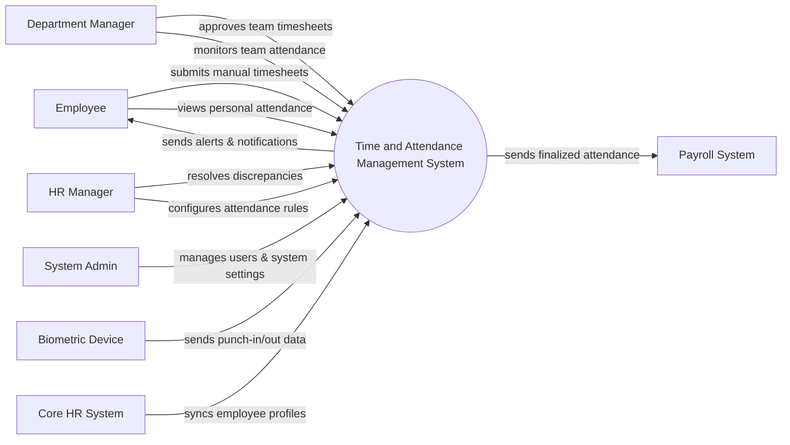

# Context Diagram — Time and Attendance Management System

## Mermaid Code

## Actor & Interaction Table | Bang Actor & Tuong tac

| # | Actor | Actor Type | Data Sent TO System | Data Received FROM System | Notes |
|---|-------|------------|---------------------|---------------------------|-------|
| 1 | Employee | Primary | Manual timesheets, shift change requests | Attendance records, notifications | Nhan vien thong thuong |
| 2 | Department Manager | Primary | Timesheet approvals, schedule assignments | Team attendance reports | Quan ly bo phan |
| 3 | HR Manager | Primary | Attendance policies, manual adjustments | Discrepancy reports, analytics | Quan ly nhan su |
| 4 | System Admin | Primary | User roles, system configurations | System logs, error alerts | Quan tri he thong |
| 5 | Biometric Device | Supporting | Real-time punch-in/out data | Device configuration updates | Thiet bi cham cong ngoai |
| 6 | Payroll System | Supporting | Payroll period confirmation | Finalized working hours, overtime | He thong tinh luong |
| 7 | Core HR System | Supporting | Employee profiles, department structure | Data sync status | He thong nhan su loi |

## System Boundary Description | Mo ta Pham vi He thong

The Time and Attendance Management System is dedicated to tracking employee working hours, shifts, and overtime. It processes data from manual inputs and external Biometric Devices to accurately calculate total time worked. The system provides approval workflows for Department Managers and monitoring tools for HR Managers. It does not handle employee salary calculations or core HR record keeping, relying on integrations with external Payroll Systems and Core HR Systems for those functions.
