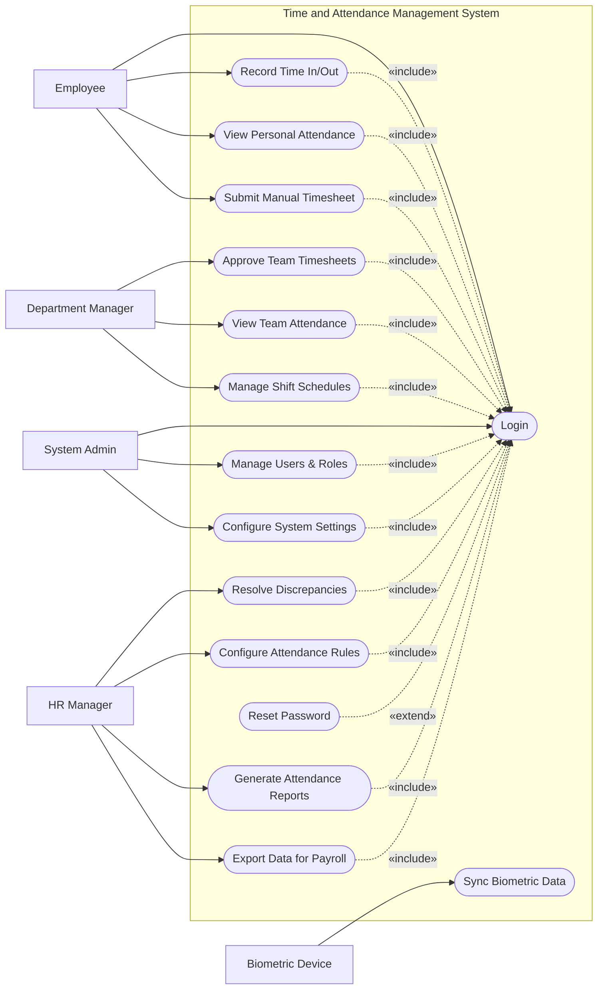

# Use Case Diagram — Time and Attendance Management System

## Mermaid Code

## Actor Table | Bang Actor

| # | Actor | Actor Type | Role Description | Related Use Cases |
|---|-------|------------|------------------|-------------------|
| 1 | Employee | Primary | Nhan vien thong thuong dung he thong | UC01, UC02, UC03, UC04, UC15 |
| 2 | Department Manager | Primary | Quan ly cua phong ban, kiem duyet cong | UC05, UC06, UC07 |
| 3 | HR Manager | Primary | Nhan su quan ly chinh sach va bao cao | UC08, UC09, UC10, UC11 |
| 4 | System Admin | Primary | Quan tri vien, quan ly tai khoan | UC01, UC12, UC13 |
| 5 | Biometric Device | System | Thiet bi gui du lieu cham cong tu dong | UC14 |

## Use Case Table | Bang Use Case

| # | UC ID | Use Case Name | Primary Actor | Secondary Actor | Description | Priority |
|---|-------|---------------|---------------|-----------------|-------------|----------|
| 1 | UC01 | Login | Employee | | Authenticate user access | High |
| 2 | UC02 | Record Time In/Out | Employee | | Manual clock in/out via web or mobile | High |
| 3 | UC03 | View Personal Attendance | Employee | | View past attendance records | Medium |
| 4 | UC04 | Submit Manual Timesheet | Employee | | Request manual time adjustments | High |
| 5 | UC05 | Approve Team Timesheets | Department Manager | | Review and approve employee timesheets | High |
| 6 | UC06 | View Team Attendance | Department Manager | | Monitor staff presence and absences | Medium |
| 7 | UC07 | Manage Shift Schedules | Department Manager | | Assign work shifts to team members | High |
| 8 | UC08 | Resolve Discrepancies | HR Manager | | Fix missing punches or errors | High |
| 9 | UC09 | Configure Attendance Rules | HR Manager | | Setup late/overtime policies | Medium |
| 10| UC10 | Generate Attendance Reports | HR Manager | | Create analytical reports | Medium |
| 11| UC11 | Export Data for Payroll | HR Manager | Payroll System | Prepare final attendance for payroll | High |
| 12| UC12 | Manage Users & Roles | System Admin | | Add or modify user accounts | High |
| 13| UC13 | Configure System Settings | System Admin | | Manage integrations and system preferences | Medium |
| 14| UC14 | Sync Biometric Data | Biometric Device | | Automatically fetch punch logs | High |
| 15| UC15 | Reset Password | Employee | | Recover access to account | High |

## Use Case Specification | Dac ta Use Case

---

### UC01 — Login

| Field | Detail |
|-------|--------|
| **UC ID** | UC01 |
| **Use Case Name** | Login |
| **Actor(s)** | Primary: Employee, Department Manager, HR Manager, System Admin |
| **Description** | Cho phep nguoi dung dang nhap vao he thong cham cong an toan. |
| **Precondition** | 1. Tai khoan da duoc tao va kich hoat.  2. He thong san sang hoat dong. |
| **Main Flow** | 1. Actor mo ung dung hoac web.  2. System hien thi form dang nhap.  3. Actor nhap username va password.  4. Actor nhan Submit.  5. System xac thuc thong tin.  6. System chuyen huong den Dashboard phu hop. |
| **Alternative Flow** | **AF1** — Quen mat khau: Actor nhan "Forgot Password", kich hoat UC15 de lay lai. |
| **Exception Flow** | **EX1** — Sai thong tin: System bao loi "Invalid credentials".  **EX2** — Tai khoan bi khoa: System bao loi va yeu cau lien he Admin. |
| **Postcondition** | Phien lam viec cua nguoi dung duoc tao va ho co extreme su dung cac chuc nang khac. |
| **Business Rule** | **BR1**: Mat khau phai ma hoa, yeu cau thay doi sau 90 ngay. |

---

### UC02 — Record Time In/Out

| Field | Detail |
|-------|--------|
| **UC ID** | UC02 |
| **Use Case Name** | Record Time In/Out |
| **Actor(s)** | Primary: Employee |
| **Description** | Nhan vien tu ghi nhan thoi gian bat dau/ket thuc ca lam viec tren app. |
| **Precondition** | 1. Nhan vien da dang nhap (UC01).  2. Nhan vien dang trong ca lam viec hop le hoac duoc phep check-in som. |
| **Main Flow** | 1. Actor mo man hinh "Clock In/Out".  2. System hien thi thoi gian hien tai va nut Clock In/Out.  3. Actor nhan nut Clock In.  4. System ghi nhan thoi gian, lay toa do GPS (neu dung mobile).  5. System luu ban ghi va hien thi thong bao thanh cong. |
| **Alternative Flow** | **AF1** — Clock Out: O buoc 3, nhan vien nhan Clock Out de ket thuc ca. |
| **Exception Flow** | **EX1** — Khong co mang: System bao loi va yeu cau check-in lai hoac nop manual timesheet.  **EX2** — Sai vi tri: Neu GPS ngoai vung cho phep, System canh bao nhung van luu (gan co canh bao). |
| **Postcondition** | Ban ghi gio vao/ra duoc luu lai trong CSDL. |
| **Business Rule** | **BR1**: Neu check-in sau gio bat dau ca, System danh dau "Late".  **BR2**: Chi duoc check-in/out toi da 1 lan moi loai cho 1 ca lam viec. |

---

### UC05 — Approve Team Timesheets

| Field | Detail |
|-------|--------|
| **UC ID** | UC05 |
| **Use Case Name** | Approve Team Timesheets |
| **Actor(s)** | Primary: Department Manager |
| **Description** | Quan ly xem xet va phe duyet ban cham cong cua nhan vien (gio lam, OT). |
| **Precondition** | 1. Manager da dang nhap.  2. Co timesheet dang o trang thai "Pending". |
| **Main Flow** | 1. Actor mo man hinh "Timesheet Approvals".  2. System hien thi danh sach timesheet can duyet.  3. Actor chon vao 1 timesheet chi tiet.  4. System hien thi tong gio lam, overtime, log cham cong chi tiet.  5. Actor nhan "Approve".  6. System cap nhat trang thai, ghi nhan lich su va gui thong bao den nhan vien. |
| **Alternative Flow** | **AF1** — Tu choi: O buoc 5, Manager nhan "Reject", nhap ly do va System gui lai cho nhan vien de chinh sua. |
| **Exception Flow** | **EX1** — Timesheet da bi chinh sua: Neu nhan vien vua rut lai timesheet truoc khi Manager duyet, System bao "Timesheet no longer available". |
| **Postcondition** | Timesheet duoc chuyen sang trang thai Approved hoac Rejected. |
| **Business Rule** | **BR1**: Manager chi xem va duyet duoc timesheet cua nhan vien thuoc pham vi quan ly.  **BR2**: Timesheet duoc Approve moi duoc tinh vao Payroll. |

---

### UC11 — Export Data for Payroll

| Field | Detail |
|-------|--------|
| **UC ID** | UC11 |
| **Use Case Name** | Export Data for Payroll |
| **Actor(s)** | Primary: HR Manager / Secondary: Payroll System |
| **Description** | HR Manager chot du lieu cham cong cuoi ky va ket xuat sang he thong luong. |
| **Precondition** | 1. HR Manager da dang nhap.  2. Tat ca timesheet cua ky da duoc duyet (Approved). |
| **Main Flow** | 1. Actor chon "Payroll Export".  2. System hien thi man hinh tong hop ky cham cong, kiem tra cac truong hop chua duoc duyet.  3. Actor xac nhan "Close Period".  4. System khoa du lieu cua ky hien tai khong cho chinh sua nua.  5. Actor chon "Export Data".  6. System tao file data chuan va tich hop gui cho Payroll System. |
| **Alternative Flow** | **AF1** — Tai file thu cong: O buoc 6, System cho phep tai file Excel hoac CSV de xu ly thu cong. |
| **Exception Flow** | **EX1** — Con du lieu chua duyet: System hien thi danh sach timesheet con Pending va chan viec xuat du lieu.  **EX2** — Loi ket noi: Neu gui sang Payroll System that bai, System canh bao va de xuat tai file thu cong. |
| **Postcondition** | Ky cham cong bi khoa va du lieu duoc chuyen sang Payroll. |
| **Business Rule** | **BR1**: Ky cham cong phai duoc khoa (Closed) truoc khi xuat du lieu.  **BR2**: Khong ai duoc sua du lieu cua ky da Closed tru System Admin. |
