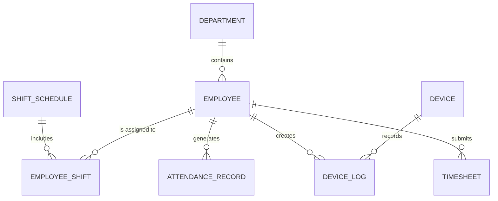

# Conceptual ERD — Time and Attendance Management System
## Mermaid Code

## Entity Description Table | Bang mo ta Entity
| # | Entity Name | Vietnamese Name | Description | Key Attributes | Main Relationships |
|---|-------------|-----------------|-------------|----------------|-------------------|
| 1 | DEPARTMENT | Phong ban | Thong tin cac phong ban | department_id, name | contains EMPLOYEE |
| 2 | EMPLOYEE | Nhan vien | Ho so co ban nhan vien | employee_id, full_name | belongs to DEPARTMENT |
| 3 | SHIFT_SCHEDULE | Ca lam viec | Dinh nghia thoi gian cac ca | shift_id, times, hours | includes EMPLOYEE_SHIFT |
| 4 | EMPLOYEE_SHIFT | Lich lam viec | Gan ca lam viec cho tung nhan vien theo ngay | emp_shift_id, date | belongs to EMPLOYEE |
| 5 | DEVICE | Thiet bi cham cong | Thiet bi biometric dat tai cong ty | device_id, location | records DEVICE_LOG |
| 6 | DEVICE_LOG | Log cham cong | Ban ghi quet the/van tay tho | log_id, punch_time | belongs to EMPLOYEE, DEVICE |
| 7 | ATTENDANCE_RECORD | Ngay cong | Tong hop gio vao ra va tinh toan cua 1 ngay | attendance_id, check_in | belongs to EMPLOYEE |
| 8 | TIMESHEET | Bang cham cong | Phieu tong hop gio lam ky luong de phe duyet | timesheet_id, status | belongs to EMPLOYEE |
## Relationship Description | Mo ta Quan he
| # | From Entity | Cardinality | To Entity | Relationship Label | Business Explanation |
|---|-------------|-------------|-----------|-------------------|----------------------|
| 1 | DEPARTMENT | one-to-many | EMPLOYEE | contains | Mot phong ban quan ly nhieu nhan vien. |
| 2 | EMPLOYEE | one-to-many | EMPLOYEE_SHIFT | is assigned to | Mot nhan vien co the duoc phan nhieu ca lam viec. |
| 3 | SHIFT_SCHEDULE | one-to-many | EMPLOYEE_SHIFT | includes | Mot ca lam viec duoc ap dung cho nhieu nhan vien. |
| 4 | DEVICE | one-to-many | DEVICE_LOG | records | Mot thiet bi se ghi nhan nhieu ban log. |
| 5 | EMPLOYEE | one-to-many | DEVICE_LOG | creates | Nhan vien tao ra nhieu log khi quet the. |
| 6 | EMPLOYEE | one-to-many | ATTENDANCE_RECORD | generates | Nhan vien co 1 ban ghi ngay cong cho moi ngay lam. |
| 7 | EMPLOYEE | one-to-many | TIMESHEET | submits | Nhan vien co 1 timesheet moi ky de gui duyet. |

