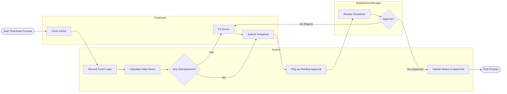

# Swimlane Diagram — Time and Attendance Management System

## Mermaid Code

## Flow Description | Mo ta luong

| Lane | Actor | Role in Flow |
|------|-------|-------------|
| 1 | Employee | Ghi nhan thoi gian lam viec, sua chua sai sot, va xac nhan/nop timesheet vao cuoi ky. |
| 2 | System | Tu dong luu log cham cong, tinh toan so gio, phat hien loi va cap nhat trang thai sau cung. |
| 3 | Department Manager | Kiem tra, xac nhan va phe duyet (hoac tu choi) timesheet cua nhan vien thuoc pham vi quan ly. |
