# Action Tree — Time and Attendance Management System

## Mermaid Code

```mermaid
%%{init: {'theme': 'default'}}%%
graph TD
    Root["Time and Attendance Management System"]

    Root --> M1["Self-Service Portal"]
    Root --> M2["Time Tracking & Logs"]
    Root --> M3["Scheduling & Shifts"]
    Root --> M4["Timesheet Approvals"]
    Root --> M5["System Administration"]

    M1 --> A11["Web/Mobile Check-in"]
    M1 --> A12["View My Attendance"]
    M1 --> A13["Submit Manual Correction"]

    M2 --> A21["Sync Device Logs"]
    M2 --> A22["Process Raw Punches"]
    M2 --> A23["Flag Discrepancies"]
    M2 --> A24["Manual Log Override"]

    M3 --> A31["Define Shift Patterns"]
    M3 --> A32["Assign Employee Shifts"]
    M3 --> A33["Manage Public Holidays"]

    M4 --> A41["Review Team Timesheets"]
    M4 --> A42["Approve Overtime Requests"]
    M4 --> A43["Lock Period Data"]
    M4 --> A44["Export to Payroll"]

    M5 --> A51["Manage User Roles"]
    M5 --> A52["Configure Policies"]
    M5 --> A53["Device Integrations"]
```

## Module Description | Mo ta Module

| # | Module | Description | Actions |
|---|--------|-------------|---------|
| 1 | Self-Service Portal | Cong thong tin ca nhan de nhan vien chu dong khai bao | Web/Mobile Check-in, View My Attendance, Submit Manual Correction |
| 2 | Time Tracking & Logs | Xu ly va phan tich du lieu log cham cong | Sync Device Logs, Process Raw Punches, Flag Discrepancies, Manual Log Override |
| 3 | Scheduling & Shifts | Quan ly thoi gian bieu va ca lam viec | Define Shift Patterns, Assign Employee Shifts, Manage Public Holidays |
| 4 | Timesheet Approvals | Quy trinh xet duyet cua quan ly va chuyen luong | Review Team Timesheets, Approve Overtime Requests, Lock Period Data, Export to Payroll |
| 5 | System Administration | Quan tri he thong va thiet lap chung | Manage User Roles, Configure Policies, Device Integrations |
