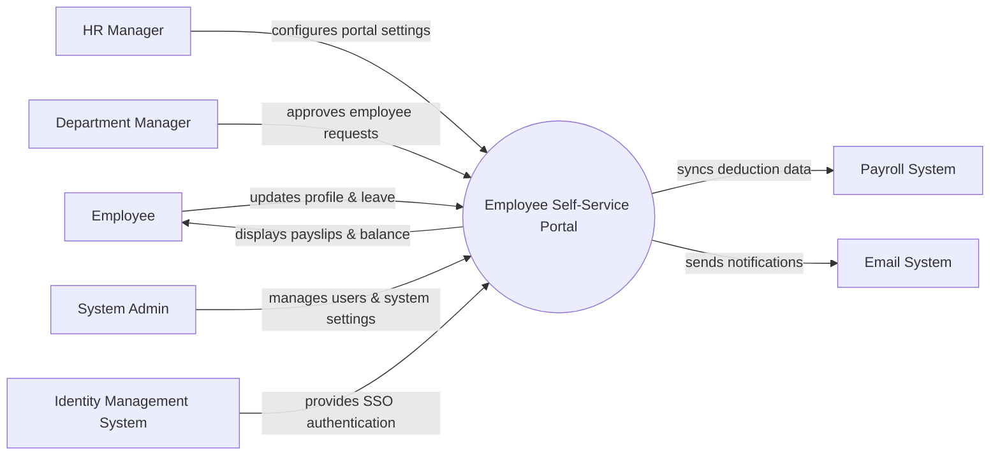

# Context Diagram — Employee Self-Service Portal

## Mermaid Code

## Actor & Interaction Table | Bang Actor & Tuong tac

| # | Actor | Actor Type | Data Sent TO System | Data Received FROM System | Notes |
|---|-------|------------|---------------------|---------------------------|-------|
| 1 | Employee | Primary | Profile updates, leave requests, expense claims | Payslips, leave balance, notifications | Nhan vien su dung portal |
| 2 | HR Manager | Primary | Company announcements, portal configurations | Aggregated employee reports | Quan ly nhan su |
| 3 | Department Manager | Primary | Request approvals, manager feedback | Team leave schedules, pending requests | Quan ly bo phan |
| 4 | System Admin | Primary | User roles, system configurations | System logs, audit reports | Quan tri he thong |
| 5 | Payroll System | Supporting | Payslip documents, tax forms | Expense and deduction data | He thong luong ngoai |
| 6 | Identity Management System | Supporting | SSO authentication tokens | Authentication requests | He thong quan ly dinh danh |
| 7 | Email System | Supporting | Email delivery statuses | Notification messages and templates | He thong gui email |

## System Boundary Description | Mo ta Pham vi He thong

The Employee Self-Service Portal serves as a centralized platform for employees to manage their personal information, submit leave and expense requests, and access payroll documents. It allows managers to review and approve these requests directly. The system relies on an external Identity Management System for authentication and integrates with a Payroll System to retrieve financial documents, while the System Admin manages user access and portal configurations.
