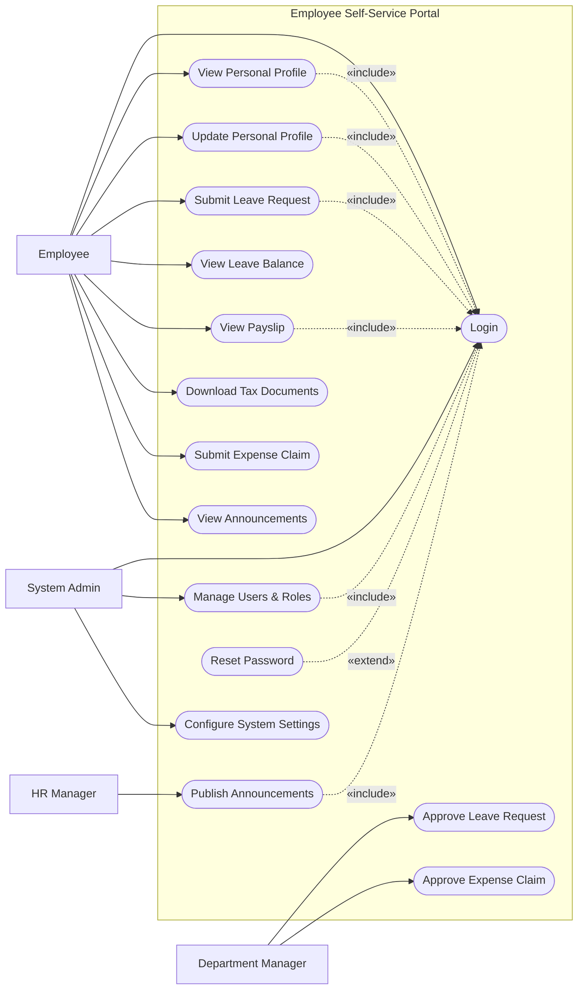

# Use Case Diagram — Employee Self-Service Portal

## Mermaid Code

## Actor Table | Bang Actor

| # | Actor | Actor Type | Role Description | Related Use Cases |
|---|-------|------------|------------------|-------------------|
| 1 | Employee | Primary | Nhan vien thong thuong tu phuc vu | UC01, UC02, UC03, UC04, UC06, UC07, UC08, UC09, UC12 |
| 2 | Department Manager | Primary | Quan ly duyet don tu cua nhan vien | UC05, UC10 |
| 3 | HR Manager | Primary | Nhan su truyen thong va quan ly chung | UC11 |
| 4 | System Admin | Primary | Quan tri vien he thong thiet lap | UC01, UC13, UC14 |

## Use Case Table | Bang Use Case

| # | UC ID | Use Case Name | Primary Actor | Secondary Actor | Description | Priority |
|---|-------|---------------|---------------|-----------------|-------------|----------|
| 1 | UC01 | Login | Employee | | Authenticate user into the portal | High |
| 2 | UC02 | View Personal Profile | Employee | | View personal and job details | High |
| 3 | UC03 | Update Personal Profile | Employee | | Edit contact info and addresses | High |
| 4 | UC04 | Submit Leave Request | Employee | | Apply for time off | High |
| 5 | UC05 | Approve Leave Request | Department Manager | | Review and decide on leave requests | High |
| 6 | UC06 | View Leave Balance | Employee | | Check remaining leave days | Medium |
| 7 | UC07 | View Payslip | Employee | Payroll System | Access monthly salary slips | High |
| 8 | UC08 | Download Tax Documents | Employee | Payroll System | Retrieve annual tax forms | Medium |
| 9 | UC09 | Submit Expense Claim | Employee | | Request reimbursement for expenses | Medium |
| 10| UC10 | Approve Expense Claim | Department Manager | | Review and decide on expense claims | Medium |
| 11| UC11 | Publish Announcements | HR Manager | | Post news to the company dashboard | Low |
| 12| UC12 | View Announcements | Employee | | Read company-wide news | Low |
| 13| UC13 | Manage Users & Roles | System Admin | | Add, update, or remove users | High |
| 14| UC14 | Configure System Settings | System Admin | | Update portal configurations | Medium |
| 15| UC15 | Reset Password | Employee | | Recover access if password is forgotten| High |

## Use Case Specification | Dac ta Use Case

---

### UC01 — Login

| Field | Detail |
|-------|--------|
| **UC ID** | UC01 |
| **Use Case Name** | Login |
| **Actor(s)** | Primary: Employee, Department Manager, HR Manager, System Admin |
| **Description** | Cho phep nguoi dung xac thuc de truy cap vao portal. |
| **Precondition** | 1. Nguoi dung co tai khoan hoat dong.  2. He thong Identity dang on dinh. |
| **Main Flow** | 1. Actor truy cap trang chu portal.  2. System hien thi man hinh dang nhap.  3. Actor nhap username va password.  4. Actor nhan Submit.  5. System goi Identity System xac thuc.  6. System dang nhap va chuyen den Dashboard. |
| **Alternative Flow** | **AF1** — Quen mat khau: O buoc 2, Actor nhan "Forgot Password", System goi UC15 Reset Password. |
| **Exception Flow** | **EX1** — Sai thong tin: Xac thuc that bai, System hien thi loi va yeu cau nhap lai.  **EX2** — Tai khoan bi khoa: Qua 5 lan sai, System khoa va yeu cau lien he Admin. |
| **Postcondition** | Phien lam viec duoc tao cho nguoi dung. |
| **Business Rule** | **BR1**: Mat khau phai duoc bam va xac thuc an toan.  **BR2**: Phien lam viec het han sau 30 phut roi mang. |

---

### UC03 — Update Personal Profile

| Field | Detail |
|-------|--------|
| **UC ID** | UC03 |
| **Use Case Name** | Update Personal Profile |
| **Actor(s)** | Primary: Employee |
| **Description** | Cho phep nhan vien cap nhat thong tin ca nhan (sdt, dia chi). |
| **Precondition** | 1. Nhan vien da dang nhap (Include UC01). |
| **Main Flow** | 1. Actor vao trang "My Profile".  2. System hien thi thong tin hien tai.  3. Actor chon "Edit Profile".  4. Actor thay doi so dien thoai va dia chi.  5. Actor nhan "Save".  6. System luu du lieu va thong bao thanh cong. |
| **Alternative Flow** | **AF1** — Huy bo: Truoc khi luu, Actor nhan "Cancel", System bo qua cac thay doi. |
| **Exception Flow** | **EX1** — Du lieu khong hop le: So dien thoai sai dinh dang, System chan luu va to do truong bi loi. |
| **Postcondition** | Thong tin ca nhan duoc cap nhat trong database. |
| **Business Rule** | **BR1**: Nhan vien chi duoc sua thong tin lien lac, khong duoc sua chuc vu hay luong. |

---

### UC04 — Submit Leave Request

| Field | Detail |
|-------|--------|
| **UC ID** | UC04 |
| **Use Case Name** | Submit Leave Request |
| **Actor(s)** | Primary: Employee |
| **Description** | Cho phep nhan vien tao va gui don xin nghi phep. |
| **Precondition** | 1. Nhan vien da dang nhap.  2. Nhan vien co du so ngay phep cho loai phep yeu cau. |
| **Main Flow** | 1. Actor chon "Request Leave".  2. System hien thi form va so phep kha dung.  3. Actor dien ngay bat dau, ket thuc, loai phep, ly do.  4. Actor nhan Submit.  5. System kiem tra tinh hop le cua don.  6. System luu trang thai "Pending" va gui email cho Manager. |
| **Alternative Flow** | **AF1** — Upload minh chung: Actor tai len giay kham benh (neu la Sick Leave) truoc khi Submit. |
| **Exception Flow** | **EX1** — Khong du phep: Neu vuot qua so phep con lai, System chan va bao loi.  **EX2** — Trung ngay: Ngay xin phep trung voi don khac, System bao loi. |
| **Postcondition** | Don luu vao he thong o trang thai cho duyet. |
| **Business Rule** | **BR1**: Nghi om tu 3 ngay tro len phai co giay kham benh.  **BR2**: Khong duoc xin phep vao ngay nghi le. |

---

### UC07 — View Payslip

| Field | Detail |
|-------|--------|
| **UC ID** | UC07 |
| **Use Case Name** | View Payslip |
| **Actor(s)** | Primary: Employee |
| **Description** | Nhan vien xem va tai phieu luong hang thang cua minh. |
| **Precondition** | 1. Nhan vien da dang nhap.  2. Luong da duoc chot tren he thong Payroll. |
| **Main Flow** | 1. Actor vao muc "My Payslips".  2. System hien thi danh sach phieu luong theo thang.  3. Actor chon xem phieu luong cua thang cu Khong.  4. System yeu cau nhap ma PIN bao mat (neu co).  5. System lay chi tiet tu Payroll System va hien thi len man hinh. |
| **Alternative Flow** | **AF1** — Tai PDF: O buoc 5, Actor chon "Download PDF", System xuat file tai ve. |
| **Exception Flow** | **EX1** — Chua co du lieu: Thang chua chot luong se hien thi "Payslip not available yet". |
| **Postcondition** | Nhan vien xem duoc chi tiet thu nhap cua minh. |
| **Business Rule** | **BR1**: Phieu luong chi duoc hien thi sau ngay tra luong chinh thuc. |

---

### UC13 — Manage Users & Roles

| Field | Detail |
|-------|--------|
| **UC ID** | UC13 |
| **Use Case Name** | Manage Users & Roles |
| **Actor(s)** | Primary: System Admin |
| **Description** | Quan tri vien them, sua, xoa, hoac phan quyen cho nguoi dung tren portal. |
| **Precondition** | 1. System Admin da dang nhap va co quyen Admin. |
| **Main Flow** | 1. Actor vao muc "User Management".  2. System hien thi danh sach tai khoan.  3. Actor chon "Edit" cho mot nguoi dung.  4. Actor thay doi vai tro (Role) hoac trang thai (Active/Inactive).  5. Actor nhan "Save".  6. System luu cau hinh va cap nhat phan quyen. |
| **Alternative Flow** | **AF1** — Them moi: O buoc 2, Actor chon "Add User" va dien form de tao moi. |
| **Exception Flow** | **EX1** — Khong the vo hieu hoa: Neu dang co gang khoa tai khoan Admin duy nhat cua he thong, System chan hanh dong va bao loi. |
| **Postcondition** | Tai khoan nguoi dung duoc cap nhat dung voi quyen han moi. |
| **Business Rule** | **BR1**: Mot nguoi dung co the co nhieu Roles ket hop.  **BR2**: Tai khoan Inactive se khong the dang nhap vao Portal. |
