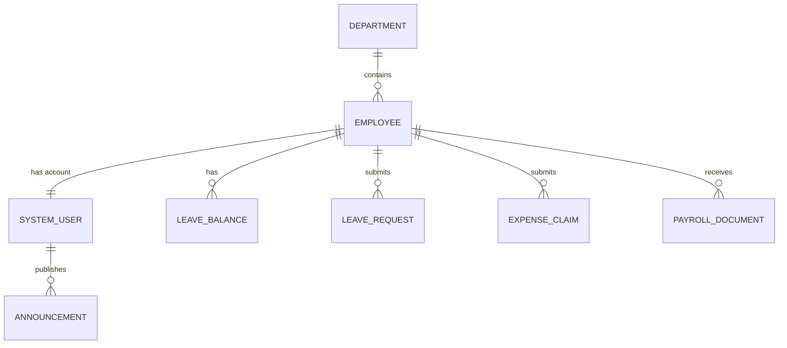

# Conceptual ERD — Employee Self-Service Portal
## Mermaid Code

## Entity Description Table | Bang mo ta Entity
| # | Entity Name | Vietnamese Name | Description | Key Attributes | Main Relationships |
|---|-------------|-----------------|-------------|----------------|-------------------|
| 1 | DEPARTMENT | Phong ban | Thong tin bo phan | department_id, department_name | contains EMPLOYEE |
| 2 | EMPLOYEE | Nhan vien | Thong tin ho so cong viec | employee_id, full_name, email | belongs to DEPARTMENT, has account SYSTEM_USER |
| 3 | SYSTEM_USER | Tai khoan | Thong tin dang nhap | user_id, username, role | belongs to EMPLOYEE |
| 4 | LEAVE_BALANCE | Quy phep | So ngay phep cua nam | balance_id, total_days | belongs to EMPLOYEE |
| 5 | LEAVE_REQUEST | Don xin nghi | Yeu cau nghi phep | request_id, dates, status | belongs to EMPLOYEE |
| 6 | EXPENSE_CLAIM | Don thanh toan | Yeu cau hoan tien chi phi | claim_id, amount, status | belongs to EMPLOYEE |
| 7 | PAYROLL_DOCUMENT| Phieu luong | Luu tru phieu luong dien tu | document_id, month_year | belongs to EMPLOYEE |
| 8 | ANNOUNCEMENT | Thong bao | Tin tuc noi bo cong ty | announcement_id, title | publishes by SYSTEM_USER |
## Relationship Description | Mo ta Quan he
| # | From Entity | Cardinality | To Entity | Relationship Label | Business Explanation |
|---|-------------|-------------|-----------|-------------------|----------------------|
| 1 | DEPARTMENT | one-to-many | EMPLOYEE | contains | Mot phong ban bao gom nhieu nhan vien. |
| 2 | EMPLOYEE | one-to-one | SYSTEM_USER | has account | Mot nhan vien co mot tai khoan truy cap portal. |
| 3 | EMPLOYEE | one-to-many | LEAVE_BALANCE | has | Mot nhan vien co quy phep cho moi nam khac nhau. |
| 4 | EMPLOYEE | one-to-many | LEAVE_REQUEST | submits | Mot nhan vien nop nhieu don nghi phep. |
| 5 | EMPLOYEE | one-to-many | EXPENSE_CLAIM | submits | Mot nhan vien co the tao nhieu don thanh toan. |
| 6 | EMPLOYEE | one-to-many | PAYROLL_DOCUMENT | receives | Mot nhan vien nhan nhieu phieu luong qua cac thang. |
| 7 | SYSTEM_USER | one-to-many | ANNOUNCEMENT | publishes | Nguoi dung (HR/Admin) co the dang nhieu thong bao. |

