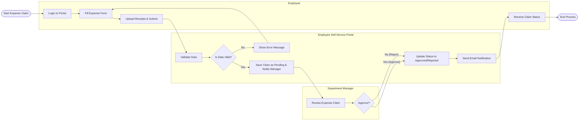

# Swimlane Diagram — Employee Self-Service Portal

## Mermaid Code

## Flow Description | Mo ta luong

| Lane | Actor | Role in Flow |
|------|-------|-------------|
| 1 | Employee | Nguoi nop don thanh toan chi phi, tai len chung tu va nhan thong bao cuoi cung. |
| 2 | Employee Self-Service Portal | He thong kiem tra du lieu, luu trang thai don va tu dong gui email dieu phuoi quy trinh. |
| 3 | Department Manager | Nguoi kiem tra tinh hop le cua khoan chi va ra quyet dinh phe duyet. |
