# Action Tree — Employee Self-Service Portal

## Mermaid Code

```mermaid
%%{init: {'theme': 'default'}}%%
graph TD
    Root["Employee Self-Service Portal"]

    Root --> M1["Profile Management"]
    Root --> M2["Leave Management"]
    Root --> M3["Financial & Payroll"]
    Root --> M4["Communication"]
    Root --> M5["System Administration"]

    M1 --> A11["View Personal Profile"]
    M1 --> A12["Update Contact Info"]
    M1 --> A13["Change Login Password"]

    M2 --> A21["Submit Leave Request"]
    M2 --> A22["View Leave Balance"]
    M2 --> A23["Approve Leave Requests"]
    M2 --> A24["View Leave History"]

    M3 --> A31["View Monthly Payslips"]
    M3 --> A32["Download Tax Documents"]
    M3 --> A33["Submit Expense Claim"]
    M3 --> A34["Approve Expense Claim"]

    M4 --> A41["View Announcements"]
    M4 --> A42["Access Company Policies"]
    M4 --> A43["Publish Announcements"]

    M5 --> A51["Manage Users & Roles"]
    M5 --> A52["Configure Portal Settings"]
    M5 --> A53["View System Logs"]
```

## Module Description | Mo ta Module

| # | Module | Description | Actions |
|---|--------|-------------|---------|
| 1 | Profile Management | Quan ly ho so va tai khoan ca nhan | View Personal Profile, Update Contact Info, Change Login Password |
| 2 | Leave Management | Tra cuu va quan ly don nghi phep | Submit Leave Request, View Leave Balance, Approve Leave Requests, View Leave History |
| 3 | Financial & Payroll | Xem phieu luong va thanh toan chi phi | View Monthly Payslips, Download Tax Documents, Submit Expense Claim, Approve Expense Claim |
| 4 | Communication | Bang tin va thong bao noi bo | View Announcements, Access Company Policies, Publish Announcements |
| 5 | System Administration | Quan tri va thiet lap he thong | Manage Users & Roles, Configure Portal Settings, View System Logs |
