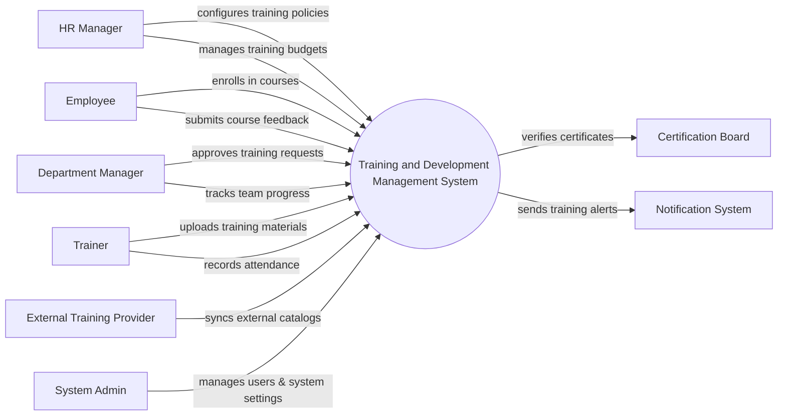

# Context Diagram — Training and Development Management System

## Mermaid Code

## Actor & Interaction Table | Bang Actor & Tuong tac

| # | Actor | Actor Type | Data Sent TO System | Data Received FROM System | Notes |
|---|-------|------------|---------------------|---------------------------|-------|
| 1 | HR Manager | Primary | Training policies, budget limits, reporting filters | Training reports, compliance alerts | Quan tri vien dao tao |
| 2 | Employee | Primary | Enrollment requests, course feedback, assessment answers | Course materials, certificates, schedules | Nhan vien hoc vien |
| 3 | Department Manager | Primary | Enrollment approvals, team skill gap assessments | Team progress reports, approval requests | Quan ly phong ban |
| 4 | Trainer | Primary | Course materials, attendance records, test scores | Class rosters, feedback summaries | Giang vien |
| 5 | External Training Provider | Supporting | External course catalogs, API integration tokens | Enrollment confirmations for external courses | Doi tac dao tao |
| 6 | Certification Board | Regulatory | Certificate verification statuses | Training completion data for validation | To chuc cap chung chi |
| 7 | Notification System | Supporting | Delivery statuses | Training alerts, reminders, emails | He thong thong bao |
| 8 | System Admin | Primary | System configurations, user roles | System logs, audit reports | Quan tri he thong |

## System Boundary Description | Mo ta Pham vi He thong

The Training and Development Management System (TDMS) handles internal and external training workflows, including course creation, employee enrollment, attendance tracking, and certification issuance. It serves as the main platform for employees to access learning materials and for HR/Managers to track skill development. The system integrates with External Training Providers for course catalogs and delegates email/SMS delivery to an external Notification System. It does not handle direct payroll deductions or complex financial transactions for external courses, which are managed by external accounting software.
