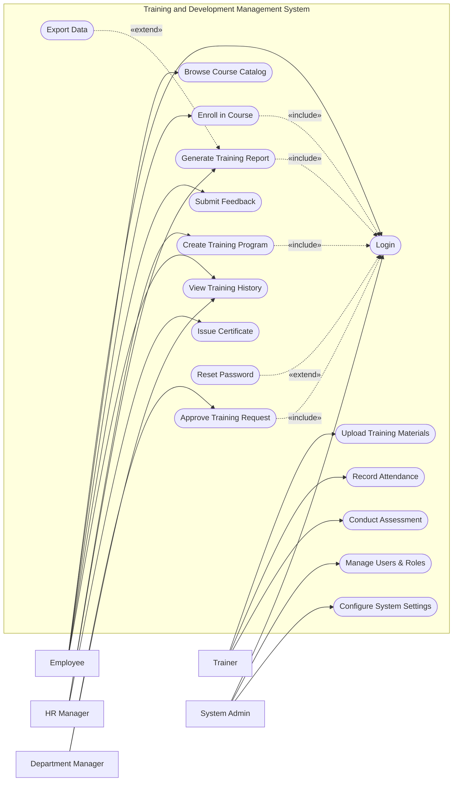

# Use Case Diagram — Training and Development Management System

## Mermaid Code

## Actor Table | Bang Actor

| # | Actor | Actor Type | Role Description | Related Use Cases |
|---|-------|------------|------------------|-------------------|
| 1 | Employee | Primary | Nhan vien tham gia cac khoa hoc nang cao ky nang | UC01, UC02, UC03, UC09, UC12 |
| 2 | Department Manager | Primary | Nguoi quan ly truc tiep, duyet don hoc tap | UC04, UC12 |
| 3 | HR Manager | Primary | Nhan su phu trach xay dung chuong trinh dao tao | UC05, UC10, UC11 |
| 4 | Trainer | Primary | Giang vien phu trach giang day va cham diem | UC06, UC07, UC08 |
| 5 | System Admin | Primary | Quan tri vien he thong, phan quyen va cai dat | UC01, UC15, UC16 |

## Use Case Table | Bang Use Case

| # | UC ID | Use Case Name | Primary Actor | Secondary Actor | Description | Priority |
|---|-------|---------------|---------------|-----------------|-------------|----------|
| 1 | UC01 | Login | Employee | | Authenticate user access | High |
| 2 | UC02 | Browse Course Catalog | Employee | | Search and view available courses | Medium |
| 3 | UC03 | Enroll in Course | Employee | | Register for a specific training program | High |
| 4 | UC04 | Approve Training Request| Department Manager| | Review and process enrollment requests | High |
| 5 | UC05 | Create Training Program | HR Manager | | Design new courses and schedules | High |
| 6 | UC06 | Upload Training Materials| Trainer | | Attach slides, docs for the course | Medium |
| 7 | UC07 | Record Attendance | Trainer | | Mark presence or absence of trainees | High |
| 8 | UC08 | Conduct Assessment | Trainer | | Create and grade course exams | Medium |
| 9 | UC09 | Submit Feedback | Employee | | Provide reviews for completed courses | Low |
| 10| UC10 | Generate Training Report| HR Manager | | Analyze training effectiveness | Medium |
| 11| UC11 | Issue Certificate | HR Manager | | Grant completion certificates to users | High |
| 12| UC12 | View Training History | Employee | Dept Manager | Check past courses and skill progress | Low |
| 13| UC13 | Reset Password | Employee | | Recover account access | High |
| 14| UC14 | Export Data | HR Manager | | Download reports as files | Low |
| 15| UC15 | Manage Users & Roles | System Admin | | Create, update, or deactivate accounts | High |
| 16| UC16 | Configure System Settings| System Admin | | Update system-wide preferences | Medium |

## Use Case Specification | Dac ta Use Case

---

### UC01 — Login

| Field | Detail |
|-------|--------|
| **UC ID** | UC01 |
| **Use Case Name** | Login |
| **Actor(s)** | Primary: Employee, HR Manager, Department Manager, Trainer, System Admin |
| **Description** | Cho phep nguoi dung xac thuc de dang nhap vao he thong. |
| **Precondition** | 1. Nguoi dung phai co tai khoan hop le tren he thong.  2. He thong dang hoat dong binh thuong. |
| **Main Flow** | 1. Actor mo trang dang nhap.  2. System hien thi form dang nhap.  3. Actor nhap username va password.  4. Actor nhan nut Submit.  5. System xac thuc thong tin.  6. System chuyen huong den trang chu tuong ung quyen han. |
| **Alternative Flow** | **AF1** — Quen mat khau: Neu Actor chon "Forgot Password", System kich hoat UC13 Reset Password. |
| **Exception Flow** | **EX1** — Sai thong tin: Neu xac thuc that bai, System hien thi thong bao loi va yeu cau nhap lai.  **EX2** — Tai khoan bi khoa: Neu nhap sai qua 5 lan, System khoa tai khoan va thong bao lien he Admin. |
| **Postcondition** | Nguoi dung duoc dang nhap va phien lam viec duoc khoi tao. |
| **Business Rule** | **BR1**: Mat khau phai duoc ma hoa.  **BR2**: Phien dang nhap tu dong het han sau 30 phut khong hoat dong. |

---

### UC03 — Enroll in Course

| Field | Detail |
|-------|--------|
| **UC ID** | UC03 |
| **Use Case Name** | Enroll in Course |
| **Actor(s)** | Primary: Employee |
| **Description** | Cho phep nhan vien dang ky tham gia mot khoa hoc tren he thong. |
| **Precondition** | 1. Nhan vien da dang nhap (Include UC01).  2. Khoa hoc dang o trang thai mo dang ky (Open for Enrollment). |
| **Main Flow** | 1. Actor xem chi tiet khoa hoc.  2. Actor nhan "Enroll Now".  3. System kiem tra dieu kien tien quyet cua khoa hoc.  4. System hien thi form xac nhan thong tin dang ky.  5. Actor nhan "Confirm".  6. System luu yeu cau dang ky, chuyen trang thai thanh "Pending Approval" va gui thong bao cho Department Manager. |
| **Alternative Flow** | **AF1** — Khoa hoc tu do: Neu khoa hoc khong can phe duyet, System doi trang thai sang "Enrolled" ngay lap tuc sau buoc 5. |
| **Exception Flow** | **EX1** — Khong du dieu kien: Neu nhan vien chua hoc cac khoa tien quyet, System bao loi va chan dang ky.  **EX2** — Khoa hoc day cho: Neu da het slot, System dua vao danh sach cho (Waitlist). |
| **Postcondition** | Don dang ky duoc luu lai va cho phe duyet hoac duoc chap nhan truc tiep. |
| **Business Rule** | **BR1**: Nhan vien chi duoc phep dang ky toi da 2 khoa hoc cung luc.  **BR2**: Yeu cau dang ky can su phe duyet tu Manager neu khoa hoc co ton phi. |

---

### UC04 — Approve Training Request

| Field | Detail |
|-------|--------|
| **UC ID** | UC04 |
| **Use Case Name** | Approve Training Request |
| **Actor(s)** | Primary: Department Manager |
| **Description** | Quan ly phong ban phe duyet hoac tu choi yeu cau dao tao cua nhan vien. |
| **Precondition** | 1. Manager da dang nhap (Include UC01).  2. Co it nhat 1 don dang ky dao tao dang cho duyet (Pending). |
| **Main Flow** | 1. Actor vao man hinh "Training Approvals".  2. System hien thi danh sach cac don dang cho.  3. Actor chon xem chi tiet mot don (khoa hoc, chi phi, thoi gian).  4. Actor nhan "Approve" (Dong y).  5. System cap nhat trang thai dang ky cua nhan vien thanh "Enrolled".  6. System gui email thong bao cho nhan vien va Trainer. |
| **Alternative Flow** | **AF1** — Tu choi: O buoc 4, Actor chon "Reject" va nhap ly do. System cap nhat trang thai thanh "Rejected" va thong bao cho nhan vien. |
| **Exception Flow** | **EX1** — Don da xu ly: Neu don da bi huy boi nhan vien, System hien thi thong bao "Request canceled by user" va tai lai trang. |
| **Postcondition** | Trang thai dang ky dao tao duoc cap nhat thanh Approved hoac Rejected. |
| **Business Rule** | **BR1**: Manager chi co the duyet don cua nhan vien thuoc phong ban minh phu trach.  **BR2**: Khong the thay doi quyet dinh sau khi da Approve/Reject. |

---

### UC05 — Create Training Program

| Field | Detail |
|-------|--------|
| **UC ID** | UC05 |
| **Use Case Name** | Create Training Program |
| **Actor(s)** | Primary: HR Manager |
| **Description** | HR Manager tao moi va cau hinh mot chuong trinh dao tao. |
| **Precondition** | 1. HR Manager da dang nhap (Include UC01).  2. Co du tham quyen de mo khoa hoc moi. |
| **Main Flow** | 1. Actor chon "Create New Program".  2. System hien thi form thong tin chuong trinh.  3. Actor nhap ten, mo ta, loai hinh, so hoc vien toi da, giang vien phu trach.  4. Actor chon luu.  5. System kiem tra tinh hop le cua du lieu.  6. System luu chuong trinh vao database va mo trang thai dang ky. |
| **Alternative Flow** | **AF1** — Luu nhap: Actor co the chon "Save as Draft" de tiep tuc chinh sua sau nay ma khong cong bo. |
| **Exception Flow** | **EX1** — Thieu thong tin: Neu de trong cac truong bat buoc, System canh bao va khong cho luu. |
| **Postcondition** | Chuong trinh dao tao duoc tao va hien thi tren Course Catalog. |
| **Business Rule** | **BR1**: Ngay ket thuc phai sau hoac bang ngay bat dau.  **BR2**: So hoc vien toi da phai > 0. |

---

### UC11 — Issue Certificate

| Field | Detail |
|-------|--------|
| **UC ID** | UC11 |
| **Use Case Name** | Issue Certificate |
| **Actor(s)** | Primary: HR Manager |
| **Description** | HR Manager cap chung chi cho hoc vien sau khi hoan thanh khoa hoc. |
| **Precondition** | 1. HR Manager da dang nhap.  2. Nhan vien da hoan thanh khoa hoc va vuot qua Assessment (diem dat yeu cau). |
| **Main Flow** | 1. Actor chon khoa hoc da ket thuc.  2. System hien thi danh sach hoc vien dat dieu kien tot nghiep.  3. Actor chon tat ca va nhan "Generate Certificates".  4. System tao file PDF chung chi cho tung hoc vien.  5. System luu chung chi vao ho so hoc vien.  6. System gui email thong bao kem link tai chung chi den hoc vien. |
| **Alternative Flow** | **AF1** — Cap rieng le: Actor chon tung hoc vien cu cu the de cap chung chi chu khong tao hang loat. |
| **Exception Flow** | **EX1** — Loi tao PDF: Neu he thong tao file that bai, System bao loi "Generation failed" va ghi log he thong. |
| **Postcondition** | Chung chi duoc cap va hoc vien co the tai ve tu ho so cua minh. |
| **Business Rule** | **BR1**: Chung chi phai co ma so (Certificate ID) duy nhat.  **BR2**: Chi cap chung chi cho nguoi co Attendance > 80% va Diem > Passing Score. |
