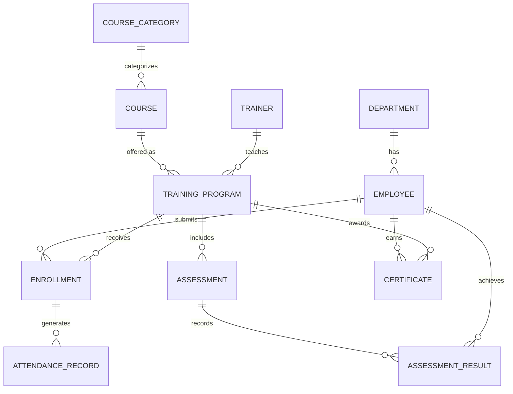

# Conceptual ERD — Training and Development Management System
## Mermaid Code

## Entity Description Table | Bang mo ta Entity
| # | Entity Name | Vietnamese Name | Description | Key Attributes | Main Relationships |
|---|-------------|-----------------|-------------|----------------|-------------------|
| 1 | DEPARTMENT | Phong ban | Thong tin cac phong ban trong cong ty | department_id, name | has EMPLOYEE |
| 2 | EMPLOYEE | Nhan vien | Ho so ca nhan cua hoc vien | employee_id, email | submits ENROLLMENT |
| 3 | TRAINER | Giang vien | Thong tin nguoi giang day khoa hoc | trainer_id, specialization | teaches TRAINING_PROGRAM |
| 4 | COURSE_CATEGORY| Danh muc khoa hoc | Phan loai cac linh vuc dao tao | category_id, name | categorizes COURSE |
| 5 | COURSE | Khoa hoc | Noi dung, giao trinh hoc tap goc | course_id, title | offered as TRAINING_PROGRAM |
| 6 | TRAINING_PROGRAM| Chuong trinh dao tao | Lop hoc cu thu voi thoi gian, giang vien | program_id, dates | receives ENROLLMENT |
| 7 | ENROLLMENT | Phieu dang ky | Phieu dang ky hoc cua nhan vien | enrollment_id, status | generates ATTENDANCE_RECORD |
| 8 | ATTENDANCE_RECORD| Diem danh | Ban ghi diem danh tung buoi hoc | attendance_id, status | belongs to ENROLLMENT |
| 9 | ASSESSMENT | Bai kiem tra | Bai thi danh gia nang luc cuoi khoa | assessment_id, score | records ASSESSMENT_RESULT |
| 10| ASSESSMENT_RESULT| Ket qua thi | Diem thi cua tung hoc vien | result_id, score | belongs to EMPLOYEE, ASSESSMENT |
| 11| CERTIFICATE | Chung chi | Chung nhan hoan thanh khoa hoc | certificate_id, url | earned by EMPLOYEE |
## Relationship Description | Mo ta Quan he
| # | From Entity | Cardinality | To Entity | Relationship Label | Business Explanation |
|---|-------------|-------------|-----------|-------------------|----------------------|
| 1 | DEPARTMENT | one-to-many | EMPLOYEE | has | Mot phong ban quan ly nhieu nhan vien. |
| 2 | COURSE_CATEGORY | one-to-many | COURSE | categorizes | Mot danh muc chua nhieu mon hoc/khoa hoc. |
| 3 | COURSE | one-to-many | TRAINING_PROGRAM | offered as | Mot mon hoc co the mo nhieu lop (chuong trinh) khac nhau. |
| 4 | TRAINER | one-to-many | TRAINING_PROGRAM | teaches | Mot giang vien the day nhieu chuong trinh dao tao. |
| 5 | EMPLOYEE | one-to-many | ENROLLMENT | submits | Mot nhan vien co the dang ky nhieu chuong trinh. |
| 6 | TRAINING_PROGRAM | one-to-many | ENROLLMENT | receives | Mot chuong trinh nhan nhieu luot dang ky tu hoc vien. |
| 7 | ENROLLMENT | one-to-many | ATTENDANCE_RECORD| generates | Moi phieu dang ky co nhieu ban ghi diem danh. |
| 8 | TRAINING_PROGRAM | one-to-many | ASSESSMENT | includes | Mot chuong trinh dao tao co the co nhieu bai kiem tra. |
| 9 | ASSESSMENT | one-to-many | ASSESSMENT_RESULT| records | Mot bai kiem tra co nhieu ket qua cham diem. |
| 10| EMPLOYEE | one-to-many | CERTIFICATE | earns | Mot nhan vien co the dat nhieu chung chi. |

