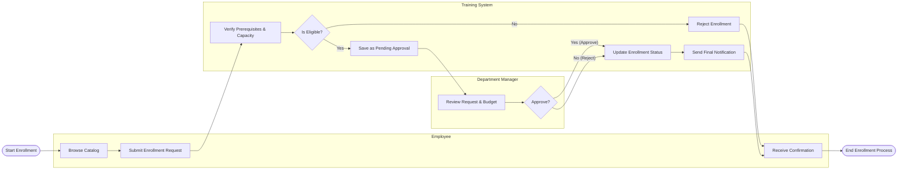

# Swimlane Diagram — Training and Development Management System

## Mermaid Code

## Flow Description | Mo ta luong

| Lane | Actor | Role in Flow |
|------|-------|-------------|
| 1 | Employee | Nguoi chon khoa hoc, tao don dang ky va cho nhan ket qua dang ky cuoi cung. |
| 2 | Training System | He thong kiem tra dieu kien tien quyet, suc chua cua lop, quan ly trang thai don, va gui thong bao email. |
| 3 | Department Manager | Nguoi quan ly xem xet su phu hop cua khoa hoc, ngan sach va ra quyet dinh duyet hoac tu choi. |
