# Action Tree — Training and Development Management System

## Mermaid Code

```mermaid
%%{init: {'theme': 'default'}}%%
graph TD
    Root["Training and Development Management System"]

    Root --> M1["Course & Curriculum Management"]
    Root --> M2["Enrollment Management"]
    Root --> M3["Learning & Assessment"]
    Root --> M4["Certification & Reports"]
    Root --> M5["System Administration"]

    M1 --> A11["Manage Course Catalog"]
    M1 --> A12["Create Training Programs"]
    M1 --> A13["Upload Learning Materials"]
    M1 --> A14["Assign Trainers"]

    M2 --> A21["Browse Available Courses"]
    M2 --> A22["Apply for Enrollment"]
    M2 --> A23["Approve/Reject Applications"]
    M2 --> A24["Manage Waitlists"]

    M3 --> A31["Access Learning Materials"]
    M3 --> A32["Track Attendance"]
    M3 --> A33["Conduct Exams/Quizzes"]
    M3 --> A34["Submit Course Feedback"]

    M4 --> A41["Grade Assessments"]
    M4 --> A42["Issue Certificates"]
    M4 --> A43["Generate Training Analytics"]
    M4 --> A44["Export Compliance Reports"]

    M5 --> A51["Manage Users & Roles"]
    M5 --> A52["Configure System Settings"]
    M5 --> A53["Monitor System Logs"]
```

## Module Description | Mo ta Module

| # | Module | Description | Actions |
|---|--------|-------------|---------|
| 1 | Course & Curriculum Management | Quan ly thong tin khoa hoc, giao trinh va lop hoc | Manage Course Catalog, Create Training Programs, Upload Learning Materials, Assign Trainers |
| 2 | Enrollment Management | Quan ly luong dang ky va xet duyet tham gia khoa hoc | Browse Available Courses, Apply for Enrollment, Approve/Reject Applications, Manage Waitlists |
| 3 | Learning & Assessment | Hoat dong hoc tap, diem danh, va danh gia thuong xuyen | Access Learning Materials, Track Attendance, Conduct Exams/Quizzes, Submit Course Feedback |
| 4 | Certification & Reports | Bao cao ket qua dao tao va cap chung chi | Grade Assessments, Issue Certificates, Generate Training Analytics, Export Compliance Reports |
| 5 | System Administration | Quan tri toan bo he thong, phan quyen nguoi dung va theo doi he thong | Manage Users & Roles, Configure System Settings, Monitor System Logs |
