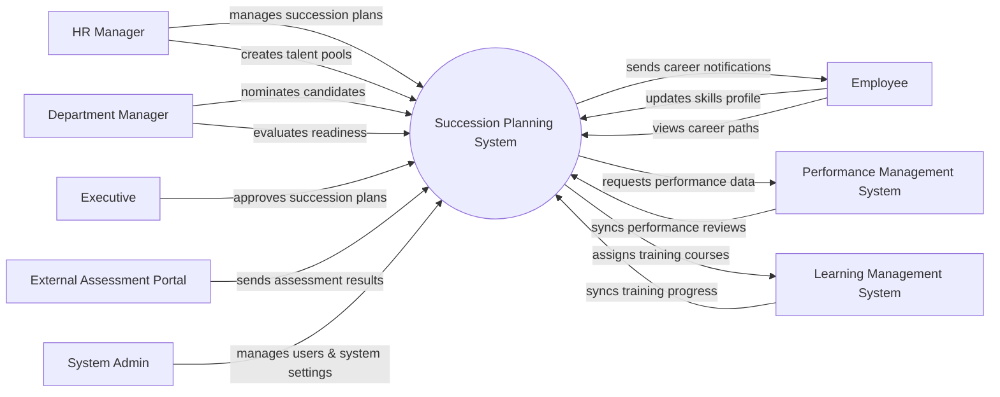

# Context Diagram — Succession Planning System

## Mermaid Code

## Actor & Interaction Table | Bang Actor & Tuong tac

| # | Actor | Actor Type | Data Sent TO System | Data Received FROM System | Notes |
|---|-------|------------|---------------------|---------------------------|-------|
| 1 | HR Manager | Primary | Succession plans, talent pool definitions | Analytics, talent reports | Quan ly nhan su |
| 2 | Department Manager | Primary | Candidate nominations, readiness evaluations | Talent pool updates | Quan ly bo phan |
| 3 | Employee | Primary | Skills profile updates, career goals | Career path suggestions, notifications | Nhan vien |
| 4 | Executive | Primary | Approvals for succession plans | High-level succession reports | Ban lanh dao |
| 5 | System Admin | Primary | System configurations, user roles | System logs, audit reports | Quan tri he thong |
| 6 | Performance Management System | Supporting | Performance review scores, appraisals | Requests for performance data | He thong danh gia hieu suat |
| 7 | Learning Management System | Supporting | Training completion status | Course assignments for candidates | He thong quan ly hoc tap |
| 8 | External Assessment Portal | Supporting | Leadership assessment scores | Candidate info for assessment | Cong danh gia nang luc ngoai |

## System Boundary Description | Mo ta Pham vi He thong

The Succession Planning System focuses on identifying and developing internal talent to fill key leadership roles within the organization. It processes skills profiles, performance metrics, and readiness evaluations to build talent pools and succession plans. The system does not directly conduct performance appraisals or deliver training courses; instead, it integrates with the Performance Management System and Learning Management System for these functions. System Admins can configure the platform and manage users, while Executives hold final approval authority over critical succession plans.
