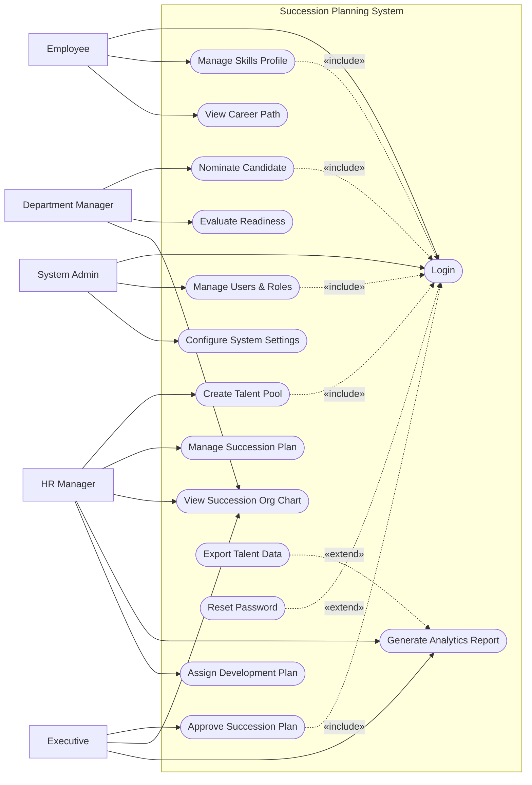

# Use Case Diagram — Succession Planning System

## Mermaid Code

## Actor Table | Bang Actor

| # | Actor | Actor Type | Role Description | Related Use Cases |
|---|-------|------------|------------------|-------------------|
| 1 | Employee | Primary | Nhan vien tiem nang cap nhat ho so ky nang va muc tieu su nghiep | UC01, UC02, UC03 |
| 2 | Department Manager | Primary | Nguoi quan ly de cu va danh gia nang luc nhan vien | UC04, UC05, UC09 |
| 3 | HR Manager | Primary | Nhan su chuyen trach xay dung va quan ly ke hoach ke nhiem | UC06, UC07, UC09, UC10, UC11 |
| 4 | Executive | Primary | Ban lanh dao phe duyet cac ke hoach ke nhiem quan trong | UC08, UC09, UC10 |
| 5 | System Admin | Primary | Quan tri vien he thong, phan quyen va cai dat | UC01, UC12, UC13 |

## Use Case Table | Bang Use Case

| # | UC ID | Use Case Name | Primary Actor | Secondary Actor | Description | Priority |
|---|-------|---------------|---------------|-----------------|-------------|----------|
| 1 | UC01 | Login | Employee | | Authenticate user access | High |
| 2 | UC02 | Manage Skills Profile | Employee | | Update skills and career goals | Medium |
| 3 | UC03 | View Career Path | Employee | | View potential roles and required skills | Low |
| 4 | UC04 | Nominate Candidate | Department Manager | | Suggest an employee for a key role | High |
| 5 | UC05 | Evaluate Readiness | Department Manager | HR Manager | Assess candidate's readiness for a role | High |
| 6 | UC06 | Create Talent Pool | HR Manager | | Group potential candidates | High |
| 7 | UC07 | Manage Succession Plan | HR Manager | | Create and update succession plans | High |
| 8 | UC08 | Approve Succession Plan | Executive | | Review and approve succession plans | High |
| 9 | UC09 | View Succession Org Chart | HR Manager | Executive, Dept Manager | Visualize key roles and successors | Medium |
| 10 | UC10 | Generate Analytics Report | HR Manager | Executive | Create talent metrics reports | Medium |
| 11 | UC11 | Assign Development Plan | HR Manager | | Assign training to candidates | Medium |
| 12 | UC12 | Manage Users & Roles | System Admin | | Create or deactivate accounts | High |
| 13 | UC13 | Configure System Settings | System Admin | | Update system-wide parameters | Medium |
| 14 | UC14 | Export Talent Data | HR Manager | | Download talent pool and plan data | Low |
| 15 | UC15 | Reset Password | Employee | | Recover account access | High |

## Use Case Specification | Dac ta Use Case

---

### UC04 — Nominate Candidate

| Field | Detail |
|-------|--------|
| **UC ID** | UC04 |
| **Use Case Name** | Nominate Candidate |
| **Actor(s)** | Primary: Department Manager |
| **Description** | Cho phep Department Manager de cu nhan vien trong phong ban cho mot vi tri chu chot (Key Position). |
| **Precondition** | 1. Manager da dang nhap (Include UC01).  2. Vi tri chu chot da duoc HR tao tren he thong. |
| **Main Flow** | 1. Actor chon vi tri chu chot can de cu.  2. System hien thi danh sach nhan vien du tieu chuan co ban.  3. Actor chon mot nhan vien.  4. System hien thi form de cu.  5. Actor nhap ly do va danh gia muc do phu hop.  6. Actor nhan Submit.  7. System luu de cu va thong bao cho HR Manager. |
| **Alternative Flow** | **AF1** — Huy de cu: Neu truoc buoc 6, Actor chon "Cancel", System quay lai trang danh sach ma khong luu. |
| **Exception Flow** | **EX1** — Nhan vien da duoc de cu: Neu nhan vien da duoc de cu cho vi tri nay, System hien thi loi "Candidate already nominated for this position" va chan Submit. |
| **Postcondition** | De cu moi duoc luu o trang thai "Pending Review". |
| **Business Rule** | **BR1**: Manager chi co the de cu nhan vien thuoc phong ban cua minh.  **BR2**: Moi vi tri chi duoc de cu toi da 3 nguoi tu mot phong ban. |

---

### UC05 — Evaluate Readiness

| Field | Detail |
|-------|--------|
| **UC ID** | UC05 |
| **Use Case Name** | Evaluate Readiness |
| **Actor(s)** | Primary: Department Manager |
| **Description** | Cho phep quan ly danh gia muc do san sang cua ung vien cho mot vi tri ke nhiem. |
| **Precondition** | 1. Manager da dang nhap (Include UC01).  2. Ung vien da duoc de cu cho vi tri. |
| **Main Flow** | 1. Actor mo danh sach ung vien can danh gia.  2. System hien thi chi tiet ung vien va tieu chi vi tri.  3. Actor chon "Evaluate".  4. System hien thi form danh gia (Timeframe: 1 year, 3 years...).  5. Actor chon muc do san sang va nhap nhan xet.  6. Actor nhan Submit.  7. System luu ket qua danh gia. |
| **Alternative Flow** | **AF1** — Luu nhap: Tai buoc 6, Actor chon "Save as Draft", System luu tam thoi ma chua hoan thanh. |
| **Exception Flow** | **EX1** — Thieu thong tin: Neu Actor khong chon muc do san sang, System bao loi va yeu cau hoan thien form. |
| **Postcondition** | Trang thai ung vien chuyen sang "Evaluated". |
| **Business Rule** | **BR1**: Muc do san sang phai duoc chon theo cac muc quy dinh (Ready Now, Ready in 1-2 Years, Ready in 3-5 Years). |

---

### UC07 — Manage Succession Plan

| Field | Detail |
|-------|--------|
| **UC ID** | UC07 |
| **Use Case Name** | Manage Succession Plan |
| **Actor(s)** | Primary: HR Manager |
| **Description** | HR Manager tao, xep hang ung vien va trinh duyet ke hoach ke nhiem cho cac vi tri. |
| **Precondition** | 1. HR Manager da dang nhap (Include UC01).  2. Da co ung vien duoc danh gia cho vi tri chu chot. |
| **Main Flow** | 1. Actor chon mot vi tri chu chot.  2. System hien thi danh sach ung vien kem ket qua danh gia.  3. Actor sap xep thu tu uu tien cua cac ung vien.  4. Actor cap nhat chien luoc phat trien (Development Plan) cho tung ung vien.  5. Actor nhan "Submit for Approval".  6. System luu ke hoach va gui thong bao den Executive de phe duyet. |
| **Alternative Flow** | **AF1** — Loai ung vien: O buoc 3, Actor the xoa mot ung vien khoi danh sach ke nhiem neu khong dat yeu cau. |
| **Exception Flow** | **EX1** — Khong co ung vien: Neu vi tri khong co ai, System canh bao "No candidates available for this plan" va chan "Submit for Approval". |
| **Postcondition** | Ke hoach ke nhiem duoc luu voi trang thai "Pending Approval". |
| **Business Rule** | **BR1**: Mot ke hoach ke nhiem can it nhat 1 ung vien "Ready Now" hoac "Ready in 1-2 Years". |

---

### UC08 — Approve Succession Plan

| Field | Detail |
|-------|--------|
| **UC ID** | UC08 |
| **Use Case Name** | Approve Succession Plan |
| **Actor(s)** | Primary: Executive |
| **Description** | Ban lanh dao xem xet va phe duyet ke hoach ke nhiem do HR de xuat. |
| **Precondition** | 1. Executive da dang nhap (Include UC01).  2. Co it nhat 1 ke hoach ke nhiem dang cho duyet (Pending Approval). |
| **Main Flow** | 1. Actor vao muc "Plan Approvals".  2. System hien thi danh sach cac ke hoach dang cho.  3. Actor chon xem chi tiet mot ke hoach.  4. System hien thi thong tin vi tri va danh sach ung vien.  5. Actor chon "Approve".  6. System cap nhat trang thai thanh "Approved" va thong bao cho HR Manager. |
| **Alternative Flow** | **AF1** — Tu choi: O buoc 5, Actor chon "Reject" va nhap ly do. System cap nhat trang thai thanh "Rejected". |
| **Exception Flow** | **EX1** — Ke hoach da duyet: Neu ke hoach da bi nguoi khac duyet, System hien thi loi "Plan already processed" va tai lai danh sach. |
| **Postcondition** | Trang thai ke hoach ke nhiem thanh "Approved" hoac "Rejected". |
| **Business Rule** | **BR1**: Ke hoach cho vi tri C-Level bat buoc phai co su phe duyet tu it nhat 2 Executives. |
