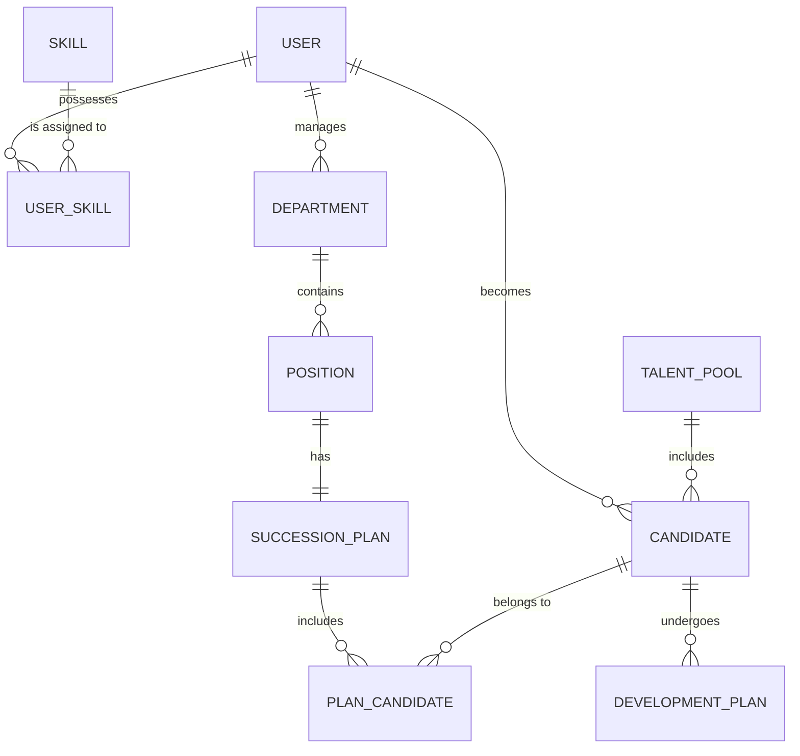

# Conceptual ERD — Succession Planning System
## Mermaid Code

## Entity Description Table | Bang mo ta Entity
| # | Entity Name | Vietnamese Name | Description | Key Attributes | Main Relationships |
|---|-------------|-----------------|-------------|----------------|-------------------|
| 1 | USER | Nguoi dung | Thong tin tai khoan cua tat ca nguoi dung | user_id, username, role_type | has many USER_SKILL, becomes CANDIDATE |
| 2 | DEPARTMENT | Phong ban | Thong tin cac phong ban trong cong ty | department_id, department_name | contains POSITION, managed by USER |
| 3 | POSITION | Vi tri | Cac chuc danh, dac biet la cac vi tri chu chot | position_id, position_title, is_key_role | belongs to DEPARTMENT, has SUCCESSION_PLAN |
| 4 | SKILL | Ky nang | Danh muc ky nang chuyen mon / mem | skill_id, skill_name, skill_category | belongs to USER_SKILL |
| 5 | USER_SKILL | Ky nang nguoi dung | Muc do thuan thuc ky nang cua nguoi dung | user_id, skill_id, proficiency_level | connects USER and SKILL |
| 6 | TALENT_POOL | Nhom tai nang | Danh sach tap hop cac ung vien tiem nang | pool_id, pool_name | includes CANDIDATE |
| 7 | CANDIDATE | Ung vien | Nhan vien duoc chon vao nhom hoac de cu | candidate_id, user_id, readiness_status | belongs to TALENT_POOL, undergoes DEVELOPMENT_PLAN |
| 8 | SUCCESSION_PLAN | Ke hoach ke nhiem | Ke hoach lua chon nguoi thay the cho vi tri | plan_id, position_id, plan_status | has PLAN_CANDIDATE |
| 9 | PLAN_CANDIDATE | Ung vien trong KH | Thu tu xep hang ung vien cho mot vi tri | plan_id, candidate_id, rank_order | connects SUCCESSION_PLAN and CANDIDATE |
| 10 | DEVELOPMENT_PLAN| Ke hoach phat trien| Muc tieu dao tao de chuan bi cho ung vien | dev_plan_id, goal_description, status | belongs to CANDIDATE |
## Relationship Description | Mo ta Quan he
| # | From Entity | Cardinality | To Entity | Relationship Label | Business Explanation |
|---|-------------|-------------|-----------|-------------------|----------------------|
| 1 | USER | one-to-many | USER_SKILL | possesses | Mot nguoi dung co the co nhieu ky nang |
| 2 | SKILL | one-to-many | USER_SKILL | is assigned to | Mot ky nang co the thuoc ve nhieu nguoi dung |
| 3 | USER | one-to-many | CANDIDATE | becomes | Mot nguoi dung co the la ung vien nhieu lan |
| 4 | DEPARTMENT | one-to-many | POSITION | contains | Mot phong ban bao gom nhieu vi tri chuc danh |
| 5 | USER | one-to-many | DEPARTMENT | manages | Mot nguoi (Manager) co the quan ly nhieu phong ban |
| 6 | TALENT_POOL | one-to-many | CANDIDATE | includes | Mot nhom tai nang se bao gom nhieu ung vien |
| 7 | POSITION | one-to-one | SUCCESSION_PLAN | has | Mot vi tri chu chot co mot ke hoach ke nhiem |
| 8 | SUCCESSION_PLAN | one-to-many | PLAN_CANDIDATE | includes | Mot ke hoach ke nhiem co nhieu ung vien xep hang |
| 9 | CANDIDATE | one-to-many | PLAN_CANDIDATE | belongs to | Mot ung vien co the nam trong nhieu ke hoach |
| 10| CANDIDATE | one-to-many | DEVELOPMENT_PLAN| undergoes | Mot ung vien co the co nhieu muc tieu phat trien |

