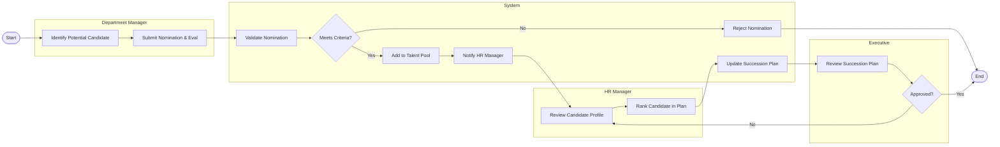

# Swimlane Diagram — Succession Planning System

## Mermaid Code

## Flow Description | Mo ta luong

| Lane | Actor | Role in Flow |
|------|-------|-------------|
| 1 | Department Manager | Phat hien nhan tai, thuc hien de cu va danh gia nang luc ban dau |
| 2 | System | Kiem tra dieu kien, cap nhat trang thai va gui cac thong bao lien quan |
| 3 | HR Manager | Kiem tra ho so ung vien, dua vao nhom tai nang va xep hang trong ke hoach ke nhiem |
| 4 | Executive | Xem xet va phe duyet ke hoach ke nhiem do HR de xuat |
