# Action Tree — Succession Planning System

## Mermaid Code

```mermaid
%%{init: {'theme': 'default'}}%%
graph TD
    Root["Succession Planning System"]

    Root --> M1["Skills & Profile Management"]
    Root --> M2["Talent Pool Management"]
    Root --> M3["Succession Planning"]
    Root --> M4["Development & Training"]
    Root --> M5["System Administration"]

    M1 --> A1["Update Skills Profile"]
    M1 --> A2["View Career Path"]
    M1 --> A3["Sync Performance Data"]

    M2 --> B1["Create Talent Pool"]
    M2 --> B2["Nominate Candidate"]
    M2 --> B3["Evaluate Readiness"]

    M3 --> C1["Create Succession Plan"]
    M3 --> C2["Rank Candidates"]
    M3 --> C3["Approve Plan"]
    M3 --> C4["View Org Chart"]

    M4 --> D1["Assign Dev Course"]
    M4 --> D2["Track Progress"]
    M4 --> D3["Generate Talent Analytics"]

    M5 --> E1["Manage Users & Roles"]
    M5 --> E2["Configure Settings"]
    M5 --> E3["Export Data"]
```

## Module Description | Mo ta Module

| # | Module | Description | Actions |
|---|--------|-------------|---------|
| 1 | Skills & Profile Management | Quan ly thong tin, ky nang va lo trinh su nghiep ung vien | Update Skills Profile, View Career Path, Sync Performance Data |
| 2 | Talent Pool Management | Phan loai, de cu va danh gia muc do san sang cua nhan vien | Create Talent Pool, Nominate Candidate, Evaluate Readiness |
| 3 | Succession Planning | Xay dung, xep hang va xet duyet ke hoach ke nhiem | Create Succession Plan, Rank Candidates, Approve Plan, View Org Chart |
| 4 | Development & Training | Gan ke hoach dao tao phat trien va theo doi bao cao | Assign Dev Course, Track Progress, Generate Talent Analytics |
| 5 | System Administration | Quan tri he thong, phan quyen va thiet lap cau hinh | Manage Users & Roles, Configure Settings, Export Data |
