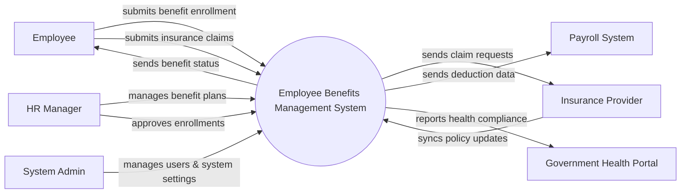

# Context Diagram — Employee Benefits Management System

## Mermaid Code

## Actor & Interaction Table | Bang Actor & Tuong tac

| # | Actor | Actor Type | Data Sent TO System | Data Received FROM System | Notes |
|---|-------|------------|---------------------|---------------------------|-------|
| 1 | Employee | Primary | Benefit enrollments, claim documents, dependent info | Benefit status, claim updates | Nhan vien trong cong ty |
| 2 | HR Manager | Primary | Plan configurations, enrollment approvals | Enrollment reports, claim summaries | Nguoi quan ly phuc loi |
| 3 | System Admin | Primary | System configurations, user roles | System logs, audit reports | Quan tri he thong |
| 4 | Insurance Provider | Supporting | Policy updates, claim resolutions | Claim requests, enrollment lists | Doi tac cung cap bao hiem |
| 5 | Payroll System | Supporting | Payroll sync confirmation | Deduction data for benefits | He thong tinh luong |
| 6 | Government Health Portal | Regulatory | Compliance guidelines | Health compliance reports | Cong y te chinh phu |

## System Boundary Description | Mo ta Pham vi He thong

The Employee Benefits Management System manages employee benefit plans, enrollments, and insurance claims. It provides a central portal for Employees to choose benefits and for HR Managers to administer them. The system does not directly process payroll or pay out insurance claims; instead, it integrates with external Payroll Systems for deductions and Insurance Providers for claim processing.
