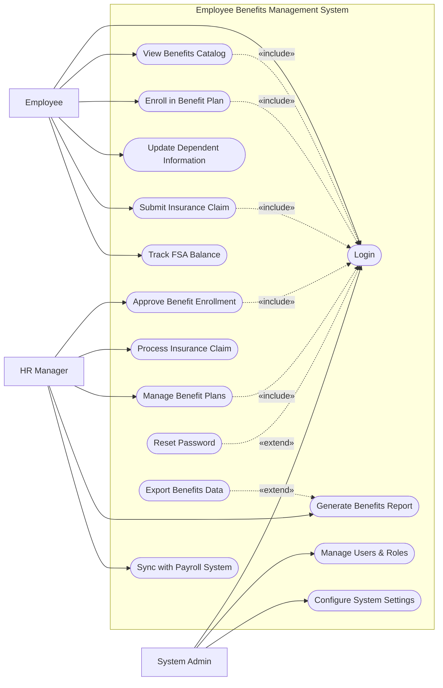

# Use Case Diagram — Employee Benefits Management System

## Mermaid Code

## Actor Table | Bang Actor

| # | Actor | Actor Type | Role Description | Related Use Cases |
|---|-------|------------|------------------|-------------------|
| 1 | Employee | Primary | Nhan vien su dung he thong de dang ky va su dung phuc loi | UC01, UC02, UC03, UC04, UC05, UC06 |
| 2 | HR Manager | Primary | Quan ly nhan su chiu trach nhiem van hanh phuc loi | UC07, UC08, UC09, UC10, UC11 |
| 3 | System Admin | Primary | Quan tri vien he thong phan quyen va cai dat | UC01, UC14, UC15 |

## Use Case Table | Bang Use Case

| # | UC ID | Use Case Name | Primary Actor | Secondary Actor | Description | Priority |
|---|-------|---------------|---------------|-----------------|-------------|----------|
| 1 | UC01 | Login | Employee | | Authenticate user access | High |
| 2 | UC02 | View Benefits Catalog | Employee | | View available benefit plans | Medium |
| 3 | UC03 | Enroll in Benefit Plan | Employee | | Select and enroll in a plan | High |
| 4 | UC04 | Update Dependent Information| Employee | | Manage dependent details | Medium |
| 5 | UC05 | Submit Insurance Claim | Employee | | File a claim for expenses | High |
| 6 | UC06 | Track FSA Balance | Employee | | View flexible spending account | Low |
| 7 | UC07 | Approve Benefit Enrollment | HR Manager | | Review and approve enrollments | High |
| 8 | UC08 | Process Insurance Claim | HR Manager | Insurance Provider | Review and forward claims | High |
| 9 | UC09 | Manage Benefit Plans | HR Manager | | Create and update plans | High |
| 10| UC10 | Generate Benefits Report | HR Manager | | Create analytical reports | Medium |
| 11| UC11 | Sync with Payroll System | HR Manager | Payroll System | Sync deductions to payroll | High |
| 12| UC12 | Reset Password | Employee | | Recover account access | High |
| 13| UC13 | Export Benefits Data | HR Manager | | Download reports | Low |
| 14| UC14 | Manage Users & Roles | System Admin | | Manage user access | High |
| 15| UC15 | Configure System Settings | System Admin | | Update system parameters | Medium |

## Use Case Specification | Dac ta Use Case

---

### UC01 — Login

| Field | Detail |
|-------|--------|
| **UC ID** | UC01 |
| **Use Case Name** | Login |
| **Actor(s)** | Primary: Employee, HR Manager, System Admin |
| **Description** | Cho phep nguoi dung xac thuc de dang nhap vao he thong. |
| **Precondition** | 1. Nguoi dung phai co tai khoan hop le.  2. He thong dang hoat dong. |
| **Main Flow** | 1. Actor mo trang dang nhap.  2. System hien thi form dang nhap.  3. Actor nhap username va password.  4. Actor nhan Submit.  5. System xac thuc thong tin.  6. System chuyen huong den Dashboard. |
| **Alternative Flow** | **AF1** — Quen mat khau: Neu chon "Forgot Password", System kich hoat UC12 Reset Password. |
| **Exception Flow** | **EX1** — Sai thong tin: Neu xac thuc that bai, System hien thi loi.  **EX2** — Tai khoan khoa: Nhap sai qua 5 lan, System khoa tai khoan. |
| **Postcondition** | Nguoi dung dang nhap thanh cong. |
| **Business Rule** | **BR1**: Mat khau phai duoc ma hoa.  **BR2**: Phien het han sau 30 phut. |

---

### UC03 — Enroll in Benefit Plan

| Field | Detail |
|-------|--------|
| **UC ID** | UC03 |
| **Use Case Name** | Enroll in Benefit Plan |
| **Actor(s)** | Primary: Employee |
| **Description** | Cho phep nhan vien dang ky goi phuc loi (bao hiem, suc khoe). |
| **Precondition** | 1. Nhan vien da dang nhap (Include UC01).  2. Dang trong thoi gian mo dang ky (Open Enrollment). |
| **Main Flow** | 1. Actor chon "Enroll Benefits".  2. System hien thi danh sach goi phuc loi.  3. Actor chon goi va them nguoi phu thuoc (neu co).  4. Actor xac nhan thong tin va chi phi.  5. Actor nhan Submit.  6. System luu yeu cau o trang thai Pending va thong bao den HR. |
| **Alternative Flow** | **AF1** — Luu nhap: Actor chon "Save Draft" de luu tam ma khong gui. |
| **Exception Flow** | **EX1** — Ngoai thoi gian: Neu khong phai Open Enrollment, System chan chuc nang va bao loi. |
| **Postcondition** | Yeu cau dang ky chuyen sang cho xet duyet (Pending). |
| **Business Rule** | **BR1**: Tong muc khau tru khong vuot qua 50% luong co ban.  **BR2**: Chi duoc phep chon 1 goi bao hiem chinh. |

---

### UC05 — Submit Insurance Claim

| Field | Detail |
|-------|--------|
| **UC ID** | UC05 |
| **Use Case Name** | Submit Insurance Claim |
| **Actor(s)** | Primary: Employee |
| **Description** | Nhan vien nop ho so yeu cau boi thuong bao hiem. |
| **Precondition** | 1. Nhan vien da dang nhap (Include UC01).  2. Nhan vien dang co goi bao hiem Active. |
| **Main Flow** | 1. Actor chon "Submit Claim".  2. System hien thi form yeu cau.  3. Actor nhap thong tin chi phi va tai len hoa don/chung tu.  4. Actor nhan Submit.  5. System kiem tra tinh day du cua tai lieu.  6. System luu ho so va gui den HR/Provider de xu ly. |
| **Alternative Flow** | **AF1** — Huy bo: Actor chon "Cancel", System quay lai man hinh truoc do. |
| **Exception Flow** | **EX1** — Thieu tai lieu: Neu khong upload chung tu, System chan Submit va yeu cau bo sung. |
| **Postcondition** | Ho so claim duoc luu o trang thai Submitted. |
| **Business Rule** | **BR1**: Dung luong file dinh kem toi da 10MB.  **BR2**: Claim phai duoc nop trong vong 30 ngay ke tu ngay phat sinh chi phi. |

---

### UC07 — Approve Benefit Enrollment

| Field | Detail |
|-------|--------|
| **UC ID** | UC07 |
| **Use Case Name** | Approve Benefit Enrollment |
| **Actor(s)** | Primary: HR Manager |
| **Description** | HR Manager phe duyet yeu cau dang ky phuc loi cua nhan vien. |
| **Precondition** | 1. HR Manager da dang nhap (Include UC01).  2. Co don dang ky o trang thai Pending. |
| **Main Flow** | 1. Actor vao "Enrollment Approvals".  2. System hien thi danh sach yeu cau Pending.  3. Actor chon xem chi tiet mot yeu cau.  4. Actor kiem tra dieu kien cua nhan vien.  5. Actor nhan "Approve".  6. System cap nhat trang thai thanh Approved va gui thong bao cho nhan vien. |
| **Alternative Flow** | **AF1** — Tu choi: Actor nhan "Reject" va nhap ly do. System cap nhat thanh Rejected va thong bao. |
| **Exception Flow** | **EX1** — Don da xu ly: Neu don da bi huy boi nhan vien, System bao loi "Request no longer available". |
| **Postcondition** | Trang thai dang ky la Approved hoac Rejected. |
| **Business Rule** | **BR1**: HR phai phe duyet truoc khi bat dau ky tinh luong.  **BR2**: Don Approved se tu dong ghi nhan so tien khau tru (Deduction). |

---

### UC14 — Manage Users & Roles

| Field | Detail |
|-------|--------|
| **UC ID** | UC14 |
| **Use Case Name** | Manage Users & Roles |
| **Actor(s)** | Primary: System Admin |
| **Description** | Admin quan ly tai khoan, phan quyen cho cac user. |
| **Precondition** | 1. Admin da dang nhap voi quyen quan tri. |
| **Main Flow** | 1. Actor vao "User Management".  2. System hien thi danh sach user hien tai.  3. Actor chon "Add User" hoac "Edit Role".  4. Actor cap nhat thong tin va phan quyen.  5. Actor nhan Save.  6. System luu thay doi. |
| **Alternative Flow** | **AF1** — Khoa tai khoan: Actor chon "Deactivate", System khoa quyen truy cap cua tai khoan do. |
| **Exception Flow** | **EX1** — Trung email: Neu tao user voi email da ton tai, System bao loi. |
| **Postcondition** | Thong tin user va quyen duoc cap nhat thanh cong. |
| **Business Rule** | **BR1**: Mot user co the co nhieu role (vi du vua la Employee vua la HR Manager). |
