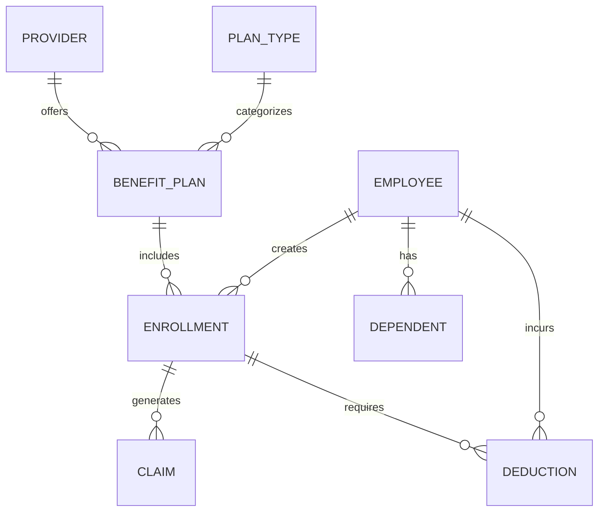

# Conceptual ERD — Employee Benefits Management System

## Mermaid Code

## Entity Description Table | Bang mo ta Entity

| # | Entity Name | Vietnamese Name | Description | Key Attributes | Main Relationships |
|---|-------------|-----------------|-------------|----------------|-------------------|
| 1 | PROVIDER | Nha cung cap | Thong tin nha cung cap bao hiem/phuc loi | provider_id, name, contact_email | offers BENEFIT_PLAN |
| 2 | PLAN_TYPE | Loai phuc loi | Phan loai cac goi (Y te, Nha khoa, FSA) | type_id, type_name | categorizes BENEFIT_PLAN |
| 3 | BENEFIT_PLAN | Goi phuc loi | Chi tiet ve cac goi phuc loi cu the | plan_id, name, monthly_cost | belongs to PROVIDER, PLAN_TYPE |
| 4 | EMPLOYEE | Nhan vien | Ho so ca nhan cua nhan vien | employee_id, name, email | creates ENROLLMENT, has DEPENDENT |
| 5 | DEPENDENT | Nguoi phu thuoc | Nguoi nha cua nhan vien tham gia bao hiem | dependent_id, name, relation | belongs to EMPLOYEE |
| 6 | ENROLLMENT | Dang ky phuc loi | Ho so dang ky phuc loi cua nhan vien | enrollment_id, status, start_date | belongs to EMPLOYEE, BENEFIT_PLAN |
| 7 | CLAIM | Yeu cau boi thuong | Ho so thanh toan chi phi tu goi bao hiem | claim_id, amount, status | belongs to ENROLLMENT |
| 8 | DEDUCTION | Khoan khau tru | So tien khau tru vao luong hang thang | deduction_id, amount, period | belongs to EMPLOYEE, ENROLLMENT |

## Relationship Description | Mo ta Quan he

| # | From Entity | Cardinality | To Entity | Relationship Label | Business Explanation |
|---|-------------|-------------|-----------|-------------------|----------------------|
| 1 | PROVIDER | one-to-many | BENEFIT_PLAN | offers | Mot nha cung cap cung cap nhieu goi phuc loi. |
| 2 | PLAN_TYPE | one-to-many | BENEFIT_PLAN | categorizes | Mot loai phuc loi ap dung cho nhieu goi khac nhau. |
| 3 | EMPLOYEE | one-to-many | ENROLLMENT | creates | Mot nhan vien co the dang ky nhieu goi phuc loi. |
| 4 | BENEFIT_PLAN | one-to-many | ENROLLMENT | includes | Mot goi phuc loi duoc nhieu nhan vien dang ky. |
| 5 | EMPLOYEE | one-to-many | DEPENDENT | has | Mot nhan vien co the khai bao nhieu nguoi phu thuoc. |
| 6 | ENROLLMENT | one-to-many | CLAIM | generates | Mot goi da dang ky co the phat sinh nhieu claim. |
| 7 | EMPLOYEE | one-to-many | DEDUCTION | incurs | Mot nhan vien co the chiu nhieu khoan khau tru. |
| 8 | ENROLLMENT | one-to-many | DEDUCTION | requires | Mot dang ky phuc loi phat sinh nhieu ky khau tru. |
