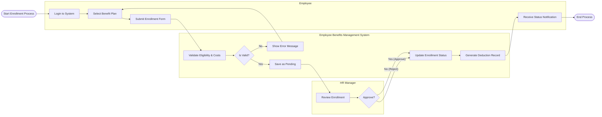

# Swimlane Diagram — Employee Benefits Management System

## Mermaid Code

## Flow Description | Mo ta luong

| Lane | Actor | Role in Flow |
|------|-------|-------------|
| 1 | Employee | Nguoi bat dau quy trinh chon goi phuc loi, dien form va nhan ket qua dang ky. |
| 2 | Employee Benefits Management System | He thong xac thuc dieu kien hop le, luu ho so, cap nhat trang thai va tao du lieu khau tru luong. |
| 3 | HR Manager | Nguoi quan ly chiu trach nhiem xet duyet hoac tu choi yeu cau dang ky cua nhan vien. |
