# Action Tree — Employee Benefits Management System

## Mermaid Code

```mermaid
%%{init: {'theme': 'default'}}%%
graph TD
    Root["Employee Benefits Management System"]

    Root --> M1["Employee Portal"]
    Root --> M2["Plan Administration"]
    Root --> M3["Claims Management"]
    Root --> M4["Reports & Integration"]
    Root --> M5["System Settings"]

    M1 --> A11["View Benefits Catalog"]
    M1 --> A12["Enroll in Benefit Plan"]
    M1 --> A13["Submit Insurance Claim"]
    M1 --> A14["Update Dependents"]

    M2 --> A21["Create Benefit Plan"]
    M2 --> A22["Configure Eligibility Rules"]
    M2 --> A23["Approve Enrollments"]
    M2 --> A24["Manage Providers"]

    M3 --> A31["Review Incoming Claims"]
    M3 --> A32["Forward Claim to Provider"]
    M3 --> A33["Update Claim Status"]
    M3 --> A34["Track FSA/HSA Usage"]

    M4 --> A41["Generate Enrollment Report"]
    M4 --> A42["Sync Deductions to Payroll"]
    M4 --> A43["Export Tax Data"]

    M5 --> A51["Manage Users & Roles"]
    M5 --> A52["Configure Notification Rules"]
    M5 --> A53["View Audit Logs"]
```

## Module Description | Mo ta Module

| # | Module | Description | Actions |
|---|--------|-------------|---------|
| 1 | Employee Portal | Giao dien danh cho nhan vien xem va dang ky phuc loi | View Benefits Catalog, Enroll in Benefit Plan, Submit Insurance Claim, Update Dependents |
| 2 | Plan Administration | Quan tri cac goi phuc loi, nha cung cap va don dang ky | Create Benefit Plan, Configure Eligibility Rules, Approve Enrollments, Manage Providers |
| 3 | Claims Management | Quan ly va theo doi cac yeu cau boi thuong cua nhan vien | Review Incoming Claims, Forward Claim to Provider, Update Claim Status, Track FSA/HSA Usage |
| 4 | Reports & Integration | Bao cao thong ke va tich hop voi cac he thong khac | Generate Enrollment Report, Sync Deductions to Payroll, Export Tax Data |
| 5 | System Settings | Quan tri phan quyen va cau hinh chung cua he thong | Manage Users & Roles, Configure Notification Rules, View Audit Logs |
