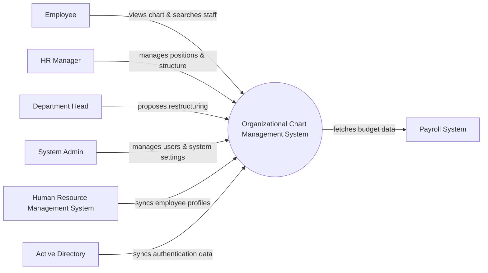

# Context Diagram — Organizational Chart Management System

## Mermaid Code

## Actor & Interaction Table | Bang Actor & Tuong tac

| # | Actor | Actor Type | Data Sent TO System | Data Received FROM System | Notes |
|---|-------|------------|---------------------|---------------------------|-------|
| 1 | Employee | Primary | Search queries | Organization chart, employee contact details | Nhan vien thong thuong |
| 2 | HR Manager | Primary | Position details, restructure approvals | Restructure proposals, version histories | Quan ly nhan su |
| 3 | Department Head | Primary | Restructure proposals | Proposal status, department chart | Truong bo phan |
| 4 | System Admin | Primary | User roles, system settings | System logs, user data | Quan tri he thong |
| 5 | Human Resource Management System | Supporting | Core employee profiles | Sync status | He thong quan ly nhan su |
| 6 | Active Directory | Supporting | User authentication data | Sync status | He thong dinh danh |
| 7 | Payroll System | Supporting | Budget limit queries | Salary band details for positions | He thong luong |

## System Boundary Description | Mo ta Pham vi He thong

The Organizational Chart Management System is a specialized tool for visualizing, planning, and managing the company's hierarchy and job positions. It serves Employees to view the structure and HR Managers to plan organizational changes. The system does not act as the primary source of truth for core HR records or payroll processing; instead, it integrates with external HRMS and Payroll Systems. Additionally, System Admins handle the security, user provisioning, and settings internally.
