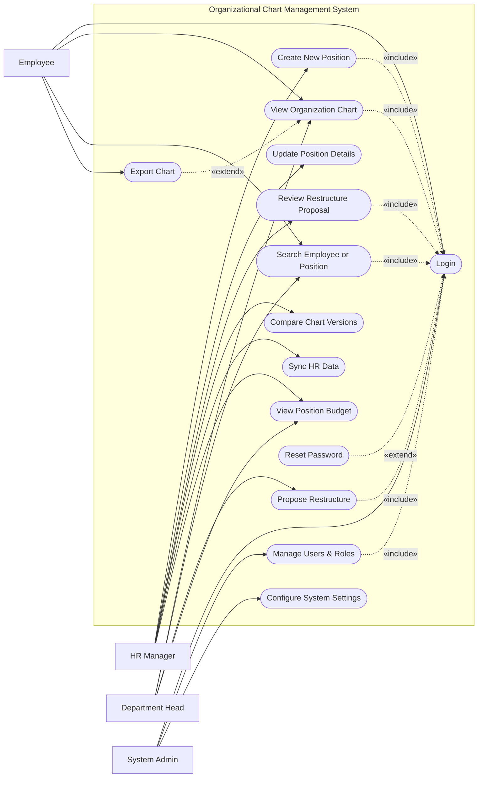

# Use Case Diagram — Organizational Chart Management System

## Mermaid Code

## Actor Table | Bang Actor

| # | Actor | Actor Type | Role Description | Related Use Cases |
|---|-------|------------|------------------|-------------------|
| 1 | Employee | Primary | Nhan vien xem so do to chuc | UC01, UC02, UC03, UC04 |
| 2 | Department Head | Primary | Truong bo phan de xuat thay doi co cau | UC02, UC03, UC07, UC11 |
| 3 | HR Manager | Primary | Nhan su quan ly co cau to chuc he thong | UC05, UC06, UC08, UC09, UC10, UC11 |
| 4 | System Admin | Primary | Quan tri vien, quan ly users and system settings | UC01, UC13, UC14 |

## Use Case Table | Bang Use Case

| # | UC ID | Use Case Name | Primary Actor | Secondary Actor | Description | Priority |
|---|-------|---------------|---------------|-----------------|-------------|----------|
| 1 | UC01 | Login | Employee | | Authenticate user access | High |
| 2 | UC02 | View Organization Chart | Employee | | View the hierarchical chart | High |
| 3 | UC03 | Search Employee or Position | Employee | | Find specific nodes in the chart | Medium |
| 4 | UC04 | Export Chart | Employee | | Download chart as PDF/Image | Low |
| 5 | UC05 | Create New Position | HR Manager | | Add a new job position | High |
| 6 | UC06 | Update Position Details | HR Manager | | Modify job details and reporting lines | High |
| 7 | UC07 | Propose Restructure | Department Head| | Submit a draft for department restructure | High |
| 8 | UC08 | Review Restructure Proposal | HR Manager | | Approve or reject restructuring | High |
| 9 | UC09 | Compare Chart Versions | HR Manager | | Compare current vs proposed chart | Medium |
| 10| UC10 | Sync HR Data | HR Manager | HRMS | Pull latest employee data | High |
| 11| UC11 | View Position Budget | HR Manager | Payroll System | View budget limitations for a role | Medium |
| 12| UC12 | Reset Password | Employee | | Recover forgotten password | High |
| 13| UC13 | Manage Users & Roles | System Admin | | Manage user access | High |
| 14| UC14 | Configure System Settings | System Admin | | Update system integrations & configs | High |

## Use Case Specification | Dac ta Use Case

---

### UC01 — Login

| Field | Detail |
|-------|--------|
| **UC ID** | UC01 |
| **Use Case Name** | Login |
| **Actor(s)** | Primary: Employee, Department Head, HR Manager, System Admin |
| **Description** | Cho phep nguoi dung xac thuc de dang nhap vao he thong. |
| **Precondition** | 1. Nguoi dung phai co tai khoan hop le tren he thong.  2. He thong dang hoat dong binh thuong. |
| **Main Flow** | 1. Actor mo trang dang nhap.  2. System hien thi form dang nhap.  3. Actor nhap username va password.  4. Actor nhan nut Submit.  5. System xac thuc thong tin.  6. System chuyen huong den trang chu tuong ung. |
| **Alternative Flow** | **AF1** — Quen mat khau: Neu Actor chon "Forgot Password", System kich hoat UC12 Reset Password. |
| **Exception Flow** | **EX1** — Sai thong tin: Neu xac thuc that bai, System hien thi thong bao loi va yeu cau nhap lai.  **EX2** — Tai khoan bi khoa: Neu nhap sai qua 5 lan, System khoa tai khoan. |
| **Postcondition** | Nguoi dung dang nhap thanh cong. |
| **Business Rule** | **BR1**: Mat khau phai duoc ma hoa.  **BR2**: Timeout sau 30 phut khong hoat dong. |

---

### UC02 — View Organization Chart

| Field | Detail |
|-------|--------|
| **UC ID** | UC02 |
| **Use Case Name** | View Organization Chart |
| **Actor(s)** | Primary: Employee, Department Head |
| **Description** | Cho phep nguoi dung xem so do to chuc cua cong ty hoac phong ban. |
| **Precondition** | 1. Nguoi dung da dang nhap (Include UC01). |
| **Main Flow** | 1. Actor chon menu "View Chart".  2. System load du lieu co cau to chuc hien tai.  3. System render so do dang cay (Tree view).  4. Actor co the thu phong (zoom in/out) va keo tha de xem cac nhanh. |
| **Alternative Flow** | **AF1** — Xuat file: Actor chon "Export", kich hoat UC04 de tai file. |
| **Exception Flow** | **EX1** — Khong tai duoc du lieu: System hien thi loi "Unable to load chart data, please try again." |
| **Postcondition** | Nguoi dung xem duoc so do to chuc. |
| **Business Rule** | **BR1**: Nhan vien chi xem duoc so do chinh thuc, khong xem duoc cac ban nhap (Draft/Proposals). |

---

### UC07 — Propose Restructure

| Field | Detail |
|-------|--------|
| **UC ID** | UC07 |
| **Use Case Name** | Propose Restructure |
| **Actor(s)** | Primary: Department Head |
| **Description** | Truong phong tao mot de xuat thay doi co cau cho phong ban minh. |
| **Precondition** | 1. Actor da dang nhap (Include UC01).  2. Actor co quyen quan ly phong ban tuong ung. |
| **Main Flow** | 1. Actor chon "Create Proposal".  2. System tao mot ban sao (draft) cua co cau hien tai.  3. Actor di chuyen, them, hoac xoa vi tri trong draft.  4. Actor nhap ly do thay doi va nhan "Submit".  5. System kiem tra tinh hop le cua de xuat.  6. System luu de xuat va thong bao den HR Manager. |
| **Alternative Flow** | **AF1** — Luu nhap: Tai buoc 4, Actor chon "Save Draft" de luu tam ma chua gui. |
| **Exception Flow** | **EX1** — Loi logic: Neu mot vi tri bao cao cho chinh no (vong lap), System chan luu va bao loi. |
| **Postcondition** | De xuat chuyen trang thai "Pending Approval" va HR Manager nhan duoc thong bao. |
| **Business Rule** | **BR1**: Moi phong ban chi duoc co 1 de xuat "Pending" tai cung 1 thoi diem. |

---

### UC08 — Review Restructure Proposal

| Field | Detail |
|-------|--------|
| **UC ID** | UC08 |
| **Use Case Name** | Review Restructure Proposal |
| **Actor(s)** | Primary: HR Manager |
| **Description** | HR Manager xem xet, phe duyet hoac tu choi de xuat thay doi co cau. |
| **Precondition** | 1. Actor da dang nhap (Include UC01).  2. Co it nhat mot de xuat dang cho duyet. |
| **Main Flow** | 1. Actor vao "Proposal Approvals".  2. System hien thi danh sach de xuat.  3. Actor chon de xuat de xem chi tiet va so sanh (Compare).  4. Actor nhan "Approve".  5. System ap dung thay doi vao so do chinh thuc.  6. System thong bao lai cho Department Head. |
| **Alternative Flow** | **AF1** — Tu choi: O buoc 4, Actor chon "Reject" kem ly do, de xuat chuyen trang thai "Rejected". |
| **Exception Flow** | **EX1** — Xung dot du lieu: Neu co thay doi he thong truoc do lam de xuat loi thoi, System bao loi "Data conflict". |
| **Postcondition** | De xuat duoc cap nhat trang thai va so do duoc ap dung neu duyet. |
| **Business Rule** | **BR1**: Sau khi duyet, phien ban so do cu phai duoc luu lai (Versioning). |

---

### UC13 — Manage Users & Roles

| Field | Detail |
|-------|--------|
| **UC ID** | UC13 |
| **Use Case Name** | Manage Users & Roles |
| **Actor(s)** | Primary: System Admin |
| **Description** | Quan tri vien them, sua, hoac phan quyen cho tai khoan nguoi dung. |
| **Precondition** | 1. System Admin da dang nhap (Include UC01). |
| **Main Flow** | 1. Actor vao man hinh "User Management".  2. System hien thi danh sach user hien tai.  3. Actor chon "Add User" va nhap thong tin.  4. Actor gan vai tro (Role) tuong ung.  5. Actor nhan "Save".  6. System luu thong tin va gui email kich hoat cho user. |
| **Alternative Flow** | **AF1** — Vo hieu hoa: Actor chon 1 user va nhan "Deactivate", System khoa quyen truy cap cua user nay. |
| **Exception Flow** | **EX1** — Trung email: Neu tao user voi email da ton tai, System bao loi "Email already registered". |
| **Postcondition** | Tai khoan nguoi dung duoc tao moi, cap nhat hoac xoa. |
| **Business Rule** | **BR1**: System Admin khong the xoa tai khoan dang co ban ghi de xuat (Proposal) dang Pending. |
