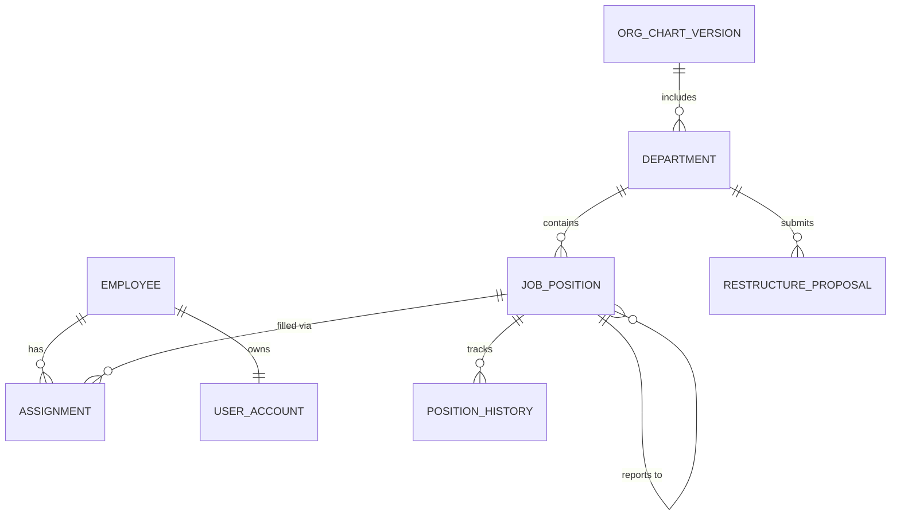

# Conceptual ERD — Organizational Chart Management System

## Mermaid Code

## Entity Description Table | Bang mo ta Entity

| # | Entity Name | Vietnamese Name | Description | Key Attributes | Main Relationships |
|---|-------------|-----------------|-------------|----------------|-------------------|
| 1 | DEPARTMENT | Phong ban | Thong tin cac phong ban trong cong ty | department_id, name, budget_limit | contains JOB_POSITION |
| 2 | JOB_POSITION | Vi tri cong viec | Thong tin chuc danh tren so do | position_id, title, is_vacant | reports to JOB_POSITION |
| 3 | EMPLOYEE | Nhan vien | Ho so ca nhan cua nhan vien | employee_id, full_name, email | has ASSIGNMENT |
| 4 | ASSIGNMENT | Phan cong | Lich su phan cong nhan vien vao vi tri | assignment_id, start_date | belongs to EMPLOYEE |
| 5 | RESTRUCTURE_PROPOSAL| De xuat thay doi| De xuat thay doi co cau | proposal_id, status, reason | belongs to DEPARTMENT |
| 6 | USER_ACCOUNT | Tai khoan | Tai khoan dang nhap he thong | user_id, username, role | belongs to EMPLOYEE |
| 7 | ORG_CHART_VERSION | Phien ban so do | Luu tru cac phien ban so do qua thoi gian | version_id, effective_date | includes DEPARTMENT |
| 8 | POSITION_HISTORY | Lich su vi tri | Ghi nhan lich su thay doi thong tin vi tri | history_id, change_date | belongs to JOB_POSITION |

## Relationship Description | Mo ta Quan he

| # | From Entity | Cardinality | To Entity | Relationship Label | Business Explanation |
|---|-------------|-------------|-----------|-------------------|----------------------|
| 1 | DEPARTMENT | one-to-many | JOB_POSITION | contains | Mot phong ban bao gom nhieu vi tri cong viec. |
| 2 | JOB_POSITION | one-to-many | JOB_POSITION | reports to | Mot vi tri quan ly nhieu vi tri cap duoi. |
| 3 | EMPLOYEE | one-to-many | ASSIGNMENT | has | Mot nhan vien co the co nhieu phan cong. |
| 4 | JOB_POSITION | one-to-many | ASSIGNMENT | filled via | Mot vi tri co nhieu luot phan cong qua cac thoi ky. |
| 5 | DEPARTMENT | one-to-many | RESTRUCTURE_PROPOSAL| submits | Mot phong ban co the nop nhieu de xuat thay doi. |
| 6 | EMPLOYEE | one-to-one | USER_ACCOUNT | owns | Moi nhan vien chi so huu mot tai khoan nguoi dung. |
| 7 | ORG_CHART_VERSION | one-to-many | DEPARTMENT | includes | Mot phien ban to chuc bao gom nhieu phong ban. |
| 8 | JOB_POSITION | one-to-many | POSITION_HISTORY | tracks | Mot vi tri co nhieu ban ghi lich su thay doi. |
