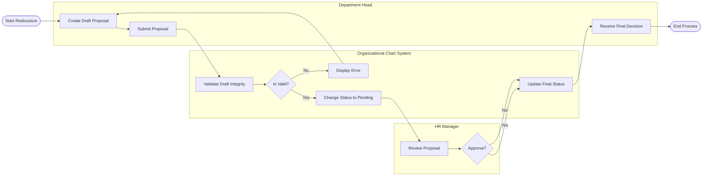

# Swimlane Diagram — Organizational Chart Management System

## Mermaid Code

## Flow Description | Mo ta luong

| Lane | Actor | Role in Flow |
|------|-------|-------------|
| 1 | Department Head | Truong phong tao ban nhap (draft), chinh sua va de xuat thay doi co cau. Nhan ket qua phe duyet. |
| 2 | Organizational Chart System | He thong kiem tra tinh toan ven cua de xuat (khong loop, du thong tin) va luu tru trang thai. |
| 3 | HR Manager | Quan ly nhan su xem xet muc do phu hop, ngan sach va dua ra quyet dinh duyet/tu choi. |
