# Action Tree — Organizational Chart Management System

## Mermaid Code

```mermaid
%%{init: {'theme': 'default'}}%%
graph TD
    Root["Organizational Chart Management System"]

    Root --> M1["Chart Visualization"]
    Root --> M2["Position Management"]
    Root --> M3["Restructuring & Planning"]
    Root --> M4["Integration & Sync"]
    Root --> M5["System Administration"]

    M1 --> A11["View Full Org Chart"]
    M1 --> A12["Search Employee/Node"]
    M1 --> A13["Export Chart to PDF"]
    M1 --> A14["Filter by Department"]

    M2 --> A21["Create New Position"]
    M2 --> A22["Update Position Detail"]
    M2 --> A23["Assign Employee"]
    M2 --> A24["Deactivate Position"]

    M3 --> A31["Create Draft Proposal"]
    M3 --> A32["Review Proposals"]
    M3 --> A33["Compare Chart Versions"]
    M3 --> A34["Manage Version History"]

    M4 --> A41["Sync HR Profiles"]
    M4 --> A42["Sync AD Accounts"]
    M4 --> A43["Fetch Payroll Budget"]

    M5 --> A51["Manage Users & Roles"]
    M5 --> A52["Configure API Settings"]
    M5 --> A53["View Audit Logs"]
```

## Module Description | Mo ta Module

| # | Module | Description | Actions |
|---|--------|-------------|---------|
| 1 | Chart Visualization | Hien thi, tim kiem va xuat file so do to chuc | View Full Org Chart, Search Employee/Node, Export Chart to PDF, Filter by Department |
| 2 | Position Management | Quan ly cac vi tri cong viec va phan cong | Create New Position, Update Position Detail, Assign Employee, Deactivate Position |
| 3 | Restructuring & Planning | Lap ke hoach va mo phong thay doi co cau | Create Draft Proposal, Review Proposals, Compare Chart Versions, Manage Version History |
| 4 | Integration & Sync | Dong bo du lieu tu cac he thong ben ngoai | Sync HR Profiles, Sync AD Accounts, Fetch Payroll Budget |
| 5 | System Administration | Quan tri tai khoan va cau hinh he thong | Manage Users & Roles, Configure API Settings, View Audit Logs |
