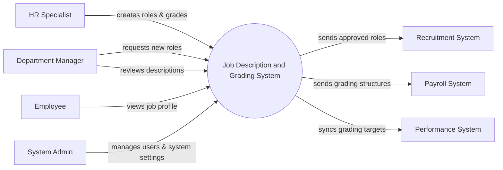

# Context Diagram — Job Description and Grading System

## Mermaid Code

## Actor & Interaction Table | Bang Actor & Tuong tac

| # | Actor | Actor Type | Data Sent TO System | Data Received FROM System | Notes |
|---|-------|------------|---------------------|---------------------------|-------|
| 1 | HR Specialist | Primary | Job descriptions, grade definitions, evaluations | System alerts, grading reports | Chuyen vien nhan su thiet lap he thong |
| 2 | Department Manager | Primary | New role requests, job description feedback | Pending approval lists | Quan ly phong ban yeu cau chuc danh |
| 3 | Employee | Primary | - | Personal job description, grade level info | Nhan vien xem thong tin chuc danh |
| 4 | System Admin | Primary | System configurations, user role assignments | System logs, audit reports | Quan tri he thong |
| 5 | Recruitment System | Supporting | - | Approved job descriptions, role requirements | He thong tuyen dung nhan du lieu |
| 6 | Payroll System | Supporting | - | Employee grades, compensation levels | He thong luong tham chieu ngach |
| 7 | Performance System | Supporting | - | Grading data, competency targets | He thong danh gia hieu suat |

## System Boundary Description | Mo ta Pham vi He thong

The Job Description and Grading System is designed to manage the creation, approval, and versioning of job roles and their corresponding grading structures. It serves as the authoritative source for organizational competencies and role evaluations. The system does not directly manage job postings or calculate salaries; instead, it provides structured job data to external Recruitment, Payroll, and Performance systems. System Administrators use the platform to manage access control and overall configurations.
