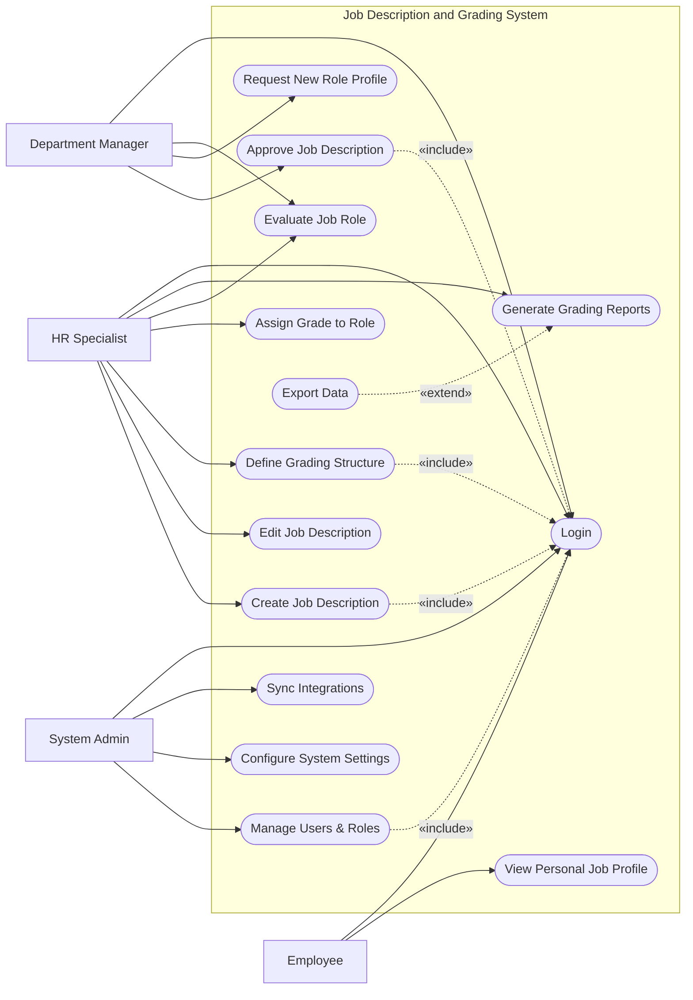

# Use Case Diagram — Job Description and Grading System

## Mermaid Code

## Actor Table | Bang Actor

| # | Actor | Actor Type | Role Description | Related Use Cases |
|---|-------|------------|------------------|-------------------|
| 1 | HR Specialist | Primary | Chuyen vien quan ly he thong chuc danh, mo ta cong viec va ngach luong | UC01, UC02, UC03, UC05, UC06, UC09, UC10 |
| 2 | Department Manager | Primary | Quan ly phong ban yeu cau tao moi chuc danh hoac danh gia vi tri | UC01, UC04, UC07, UC09 |
| 3 | Employee | Primary | Nhan vien trong cong ty xem thong tin mo ta cong viec | UC01, UC08 |
| 4 | System Admin | Primary | Quan tri vien he thong, phan quyen va cai dat tham so | UC01, UC12, UC13, UC14 |

## Use Case Table | Bang Use Case

| # | UC ID | Use Case Name | Primary Actor | Secondary Actor | Description | Priority |
|---|-------|---------------|---------------|-----------------|-------------|----------|
| 1 | UC01 | Login | HR Specialist | | Xac thuc nguoi dung | High |
| 2 | UC02 | Create Job Description | HR Specialist | | Tao moi mo ta cong viec | High |
| 3 | UC03 | Edit Job Description | HR Specialist | | Chinh sua mo ta cong viec | High |
| 4 | UC04 | Approve Job Description | Department Manager | | Phe duyet mo ta cong viec | High |
| 5 | UC05 | Define Grading Structure | HR Specialist | | Thiet lap he thong ngach/cap bac | High |
| 6 | UC06 | Assign Grade to Role | HR Specialist | | Gan ngach/cap bac cho chuc danh | High |
| 7 | UC07 | Request New Role Profile | Department Manager | | Yeu cau tao moi chuc danh | Medium |
| 8 | UC08 | View Personal Job Profile | Employee | | Xem mo ta cong viec ca nhan | Low |
| 9 | UC09 | Evaluate Job Role | HR Specialist | Department Manager | Danh gia lai chuc danh | Medium |
| 10| UC10 | Generate Grading Reports | HR Specialist | | Xuat bao cao he thong ngach | Medium |
| 11| UC11 | Export Data | HR Specialist | | Xuat du lieu duoi dang file | Low |
| 12| UC12 | Manage Users & Roles | System Admin | | Quan ly tai khoan va phan quyen | High |
| 13| UC13 | Configure System Settings | System Admin | | Cai dat tham so he thong | Medium |
| 14| UC14 | Sync Integrations | System Admin | | Dong bo du lieu voi he thong khac| Low |

## Use Case Specification | Dac ta Use Case

---

### UC02 — Create Job Description

| Field | Detail |
|-------|--------|
| **UC ID** | UC02 |
| **Use Case Name** | Create Job Description |
| **Actor(s)** | Primary: HR Specialist |
| **Description** | Cho phep HR tao mot mo ta cong viec (Job Description) moi tren he thong. |
| **Precondition** | 1. HR Specialist da dang nhap (Include UC01).  2. He thong danh muc phong ban da san sang. |
| **Main Flow** | 1. Actor chon chuc nang "Create Job Profile".  2. System hien thi form tao mo ta cong viec.  3. Actor dien cac thong tin: Title, Department, Responsibilities, Requirements.  4. Actor nhan Submit.  5. System kiem tra tinh hop le.  6. System luu vao CSDL voi trang thai "Draft" va thong bao thanh cong. |
| **Alternative Flow** | **AF1** — Luu tam: Neu Actor chon "Save Draft", System se luu thong tin nhung khong check bat buoc dien het cac truong. |
| **Exception Flow** | **EX1** — Thieu thong tin: Neu Actor de trong truong bat buoc (vi du Title), System bao loi va chan Submit. |
| **Postcondition** | Mot ban ghi Job Description moi duoc tao voi trang thai "Draft". |
| **Business Rule** | **BR1**: Chuc danh cong viec (Job Title) phai la duy nhat trong mot phong ban. |

---

### UC04 — Approve Job Description

| Field | Detail |
|-------|--------|
| **UC ID** | UC04 |
| **Use Case Name** | Approve Job Description |
| **Actor(s)** | Primary: Department Manager |
| **Description** | Quan ly phong ban xem xet va phe duyet mo ta cong viec do HR tao ra. |
| **Precondition** | 1. Manager da dang nhap (Include UC01).  2. Co mo ta cong viec o trang thai "Pending Approval". |
| **Main Flow** | 1. Actor vao danh sach "Pending Job Descriptions".  2. System hien thi cac mo ta cong viec can duyet.  3. Actor chon xem chi tiet mot mo ta.  4. Actor nhan "Approve".  5. System chuyen trang thai Job Description thanh "Approved" va gui thong bao cho HR. |
| **Alternative Flow** | **AF1** — Tu choi: Actor chon "Reject" va nhap ly do. System cap nhat trang thai thanh "Rejected". |
| **Exception Flow** | **EX1** — Phien ban thay doi: Neu ban ghi da bi nguoi khac sua chua trong luc Manager dang xem, System thong bao "Data modified" va tai lai trang. |
| **Postcondition** | Trang thai mo ta cong viec duoc cap nhat. |
| **Business Rule** | **BR1**: Chi Department Manager cua phong ban tuong ung moi duoc phep duyet. |

---

### UC05 — Define Grading Structure

| Field | Detail |
|-------|--------|
| **UC ID** | UC05 |
| **Use Case Name** | Define Grading Structure |
| **Actor(s)** | Primary: HR Specialist |
| **Description** | Thiet lap va quan ly cau truc ngach luong, cap bac trong cong ty. |
| **Precondition** | 1. HR Specialist da dang nhap (Include UC01). |
| **Main Flow** | 1. Actor chon "Grading Management".  2. System hien thi danh sach cac Level/Grade hien co.  3. Actor nhan tao moi hoac sua Grade (VD: G1, G2, Senior...).  4. Actor nhap cac thong so: Ten Grade, Level, Range Diem (Neu co).  5. Actor nhan Save.  6. System luu thay doi va ap dung vao danh muc Grade. |
| **Alternative Flow** | **AF1** — Xoa Grade: Actor chon xoa Grade khong su dung, System yeu cau xac nhan va xoa. |
| **Exception Flow** | **EX1** — Trung lap: Neu ma Grade hoac Level da ton tai, System canh bao "Grade Code Must Be Unique".  **EX2** — Dang su dung: Neu xoa mot Grade dang duoc gan cho Role, System chan khong cho xoa. |
| **Postcondition** | Cau truc Grade duoc cap nhat hoac tao moi tren he thong. |
| **Business Rule** | **BR1**: Khong the xoa Grade dang co nguoi hoac chuc danh so huu. |

---

### UC06 — Assign Grade to Role

| Field | Detail |
|-------|--------|
| **UC ID** | UC06 |
| **Use Case Name** | Assign Grade to Role |
| **Actor(s)** | Primary: HR Specialist |
| **Description** | HR danh gia chuc danh cong viec va gan Grade phu hop. |
| **Precondition** | 1. HR Specialist da dang nhap (Include UC01).  2. Job Description da duoc "Approved". |
| **Main Flow** | 1. Actor mo chi tiet mot Job Description.  2. Actor chon tinh nang "Assign Grade".  3. System hien thi danh sach cac Grade kha dung.  4. Actor chon mot Grade va nhap ly do hoac diem danh gia.  5. Actor nhan Save.  6. System cap nhat Grade cho chuc danh va ban hanh. |
| **Alternative Flow** | **AF1** — Thay doi Grade: Actor the hien viec nang/giam ngach cua mot chuc danh hien co. |
| **Exception Flow** | **EX1** — Mo ta chua duyet: Neu Job Description chua qua trang thai Approved, System khong cho phep gan Grade. |
| **Postcondition** | Chuc danh cong viec so huu mot Grade cu the, co the tich hop sang he thong luong. |
| **Business Rule** | **BR1**: Moi Job Role chi co mot Grade tai mot thoi diem nhat dinh. |

---

### UC12 — Manage Users & Roles

| Field | Detail |
|-------|--------|
| **UC ID** | UC12 |
| **Use Case Name** | Manage Users & Roles |
| **Actor(s)** | Primary: System Admin |
| **Description** | Quan tri vien them, sua, xoa, va phan quyen nguoi dung. |
| **Precondition** | 1. System Admin da dang nhap (Include UC01). |
| **Main Flow** | 1. Actor mo muc "User Management".  2. System hien thi danh sach nguoi dung hien tai.  3. Actor chon "Add User" va nhap cac thong tin co ban.  4. Actor chon phan quyen (VD: HR Specialist, Manager).  5. Actor nhan Submit.  6. System luu tai khoan va gui email thiet lap mat khau. |
| **Alternative Flow** | **AF1** — Vo hieu hoa: Actor chon "Deactivate" cho mot tai khoan dang hoat dong de chan dang nhap. |
| **Exception Flow** | **EX1** — Email trung lap: Neu email da ton tai, System thong bao "Email already registered". |
| **Postcondition** | Tai khoan nguoi dung moi duoc tao hoac cap nhat tren he thong. |
| **Business Rule** | **BR1**: Nguoi dung vo hieu hoa se lap tuc bi thoat khoi phien dang nhap hien tai. |
