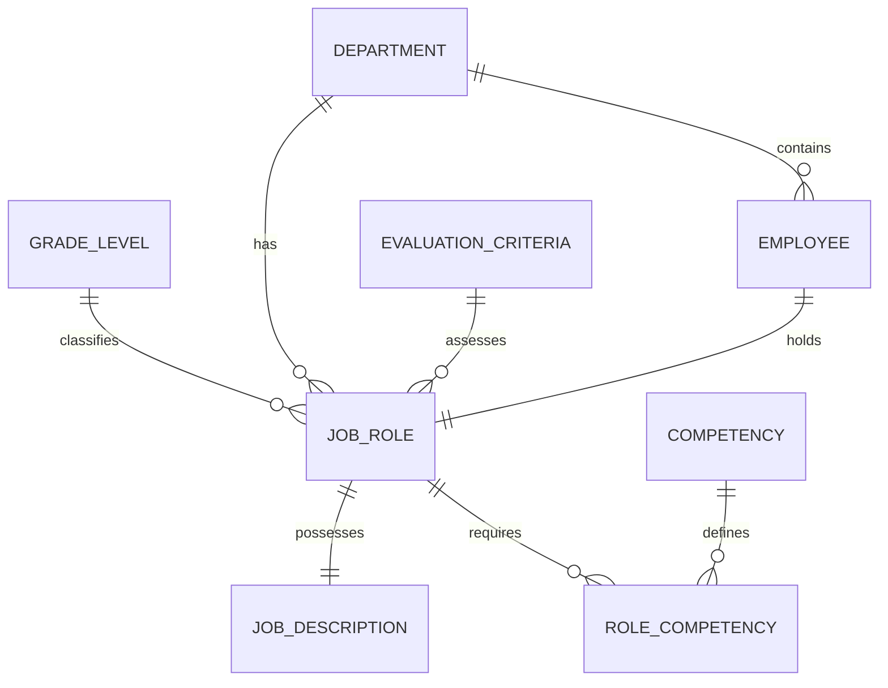

# Conceptual ERD — Job Description and Grading System

## Mermaid Code

## Entity Description Table | Bang mo ta Entity

| # | Entity Name | Vietnamese Name | Description | Key Attributes | Main Relationships |
|---|-------------|-----------------|-------------|----------------|-------------------|
| 1 | DEPARTMENT | Phong ban | Thong tin cac phong ban trong cong ty | department_id, name | has JOB_ROLE, contains EMPLOYEE |
| 2 | JOB_ROLE | Chuc danh cong viec | Vi tri cong viec chinh thuc trong to chuc | role_id, title, status | belongs to DEPARTMENT, has JOB_DESCRIPTION |
| 3 | JOB_DESCRIPTION | Mo ta cong viec | Chi tiet trach nhiem va yeu cau cong viec | jd_id, responsibilities, requirements | belongs to JOB_ROLE |
| 4 | GRADE_LEVEL | Ngach/Cap bac luong | Dinh nghia cac cap bac cong viec | grade_id, level_code, salary_range | classifies JOB_ROLE |
| 5 | COMPETENCY | Nang luc | Danh muc nang luc chung cua to chuc | competency_id, name, type | defines ROLE_COMPETENCY |
| 6 | ROLE_COMPETENCY | Nang luc chuc danh | Yeu cau muc do nang luc cho tung chuc danh | role_comp_id, required_score | belongs to JOB_ROLE, belongs to COMPETENCY |
| 7 | EMPLOYEE | Nhan vien | Ho so ca nhan cua nhan vien trong he thong | employee_id, full_name, email | belongs to DEPARTMENT, holds JOB_ROLE |
| 8 | EVALUATION_CRITERIA | Tieu chi danh gia | Tieu chi dung de danh gia xep ngach chuc danh | criteria_id, metric_name, weight | assesses JOB_ROLE |

## Relationship Description | Mo ta Quan he

| # | From Entity | Cardinality | To Entity | Relationship Label | Business Explanation |
|---|-------------|-------------|-----------|-------------------|----------------------|
| 1 | DEPARTMENT | one-to-many | JOB_ROLE | has | Mot phong ban co the co nhieu chuc danh cong viec. |
| 2 | JOB_ROLE | one-to-one | JOB_DESCRIPTION | possesses | Moi chuc danh co dung mot ban mo ta cong viec chi tiet. |
| 3 | GRADE_LEVEL | one-to-many | JOB_ROLE | classifies | Mot ngach/cap bac co the duoc phan loai cho nhieu chuc danh khac nhau. |
| 4 | COMPETENCY | one-to-many | ROLE_COMPETENCY | defines | Mot nang luc chung duoc su dung the hien tren nhieu yeu cau nang luc chuc danh khac nhau. |
| 5 | JOB_ROLE | one-to-many | ROLE_COMPETENCY | requires | Mot chuc danh yeu cau phai dap ung nhieu nang luc cu the. |
| 6 | EMPLOYEE | one-to-one | JOB_ROLE | holds | Moi nhan vien hien tai nam giu mot chuc danh chinh thuc (tai mot thoi diem). |
| 7 | DEPARTMENT | one-to-many | EMPLOYEE | contains | Mot phong ban quan ly va chua nhieu nhan vien. |
| 8 | EVALUATION_CRITERIA | one-to-many | JOB_ROLE | assesses | Mot tieu chi danh gia co the duoc su dung de xep ngach cho nhieu chuc danh. |
