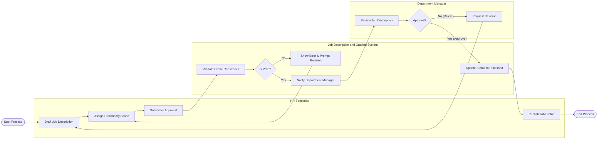

# Swimlane Diagram — Job Description and Grading System

## Mermaid Code

## Flow Description | Mo ta luong

| Lane | Actor | Role in Flow |
|------|-------|-------------|
| 1 | HR Specialist | Nguoi chu dong soan thao mo ta cong viec, de xuat ngach luong va phat hanh ho so sau khi duoc duyet. |
| 2 | Job Description and Grading System | He thong kiem tra tinh hop le cua ngach luong, gui thong bao va cap nhat trang thai tu dong. |
| 3 | Department Manager | Nguoi quan ly nhan thong bao, vao xem xet va ra quyet dinh phe duyet hoac yeu cau chinh sua mo ta cong viec. |
