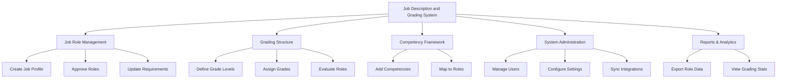

# Action Tree — Job Description and Grading System

## Mermaid Code

## Module Description | Mo ta Module

| # | Module | Description | Actions |
|---|--------|-------------|---------|
| 1 | Job Role Management | Quan ly danh muc va mo ta chi tiet tung chuc danh | Create Job Profile, Approve Roles, Update Requirements |
| 2 | Grading Structure | Thiet lap va quan ly he thong cap bac luong | Define Grade Levels, Assign Grades, Evaluate Roles |
| 3 | Competency Framework | Quan ly khung nang luc va gan ket voi chuc danh | Add Competencies, Map to Roles |
| 4 | System Administration | Quan tri he thong, phan quyen va cau hinh chung | Manage Users, Configure Settings, Sync Integrations |
| 5 | Reports & Analytics | Xuat du lieu va cung cap bao cao thong ke | Export Role Data, View Grading Stats |
