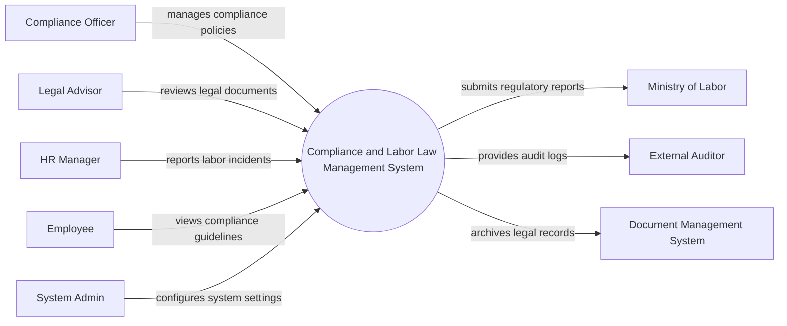

# Context Diagram — Compliance and Labor Law Management System

## Mermaid Code

## Actor & Interaction Table | Bang Actor & Tuong tac

| # | Actor | Actor Type | Data Sent TO System | Data Received FROM System | Notes |
|---|-------|------------|---------------------|---------------------------|-------|
| 1 | Compliance Officer | Primary | Compliance policies, risk assessments | Compliance reports, alerts | Can bo tuan thu |
| 2 | Legal Advisor | Primary | Legal document reviews, case updates | Legal cases, incident details | Co van phap ly |
| 3 | HR Manager | Primary | Labor incident reports, employee data | Resolution updates | Quan ly nhan su |
| 4 | Employee | Primary | Policy acknowledgements, incident reports | Compliance guidelines, notifications | Nhan vien thong thuong |
| 5 | Ministry of Labor | Regulatory | Labor law updates | Regulatory compliance reports | Bo Lao dong |
| 6 | External Auditor | Regulatory | Audit requests | Audit logs, compliance data | Kiem toan doc lap |
| 7 | Document Management System | Supporting | Archived document references | Legal records, policy documents | He thong quan ly tai lieu |
| 8 | System Admin | Primary | System configurations, user roles | System logs, audit reports | Quan tri he thong |

## System Boundary Description | Mo ta Pham vi He thong

The Compliance and Labor Law Management System is responsible for managing organizational compliance policies, labor incident reports, and legal cases. It serves as the central platform for Compliance Officers, Legal Advisors, and Employees to interact regarding regulatory guidelines and labor laws. The system does not directly manage core HR operations or payroll; it focuses strictly on compliance tracking and regulatory reporting. Additionally, it integrates with external Document Management Systems for archiving and provides necessary data to the Ministry of Labor and External Auditors.
