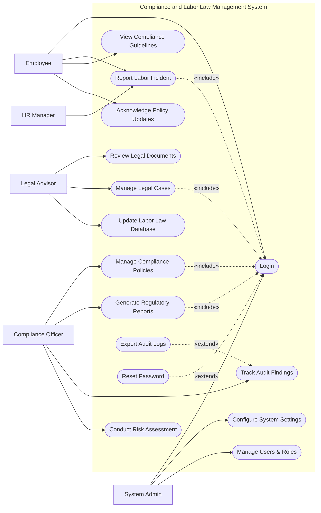

# Use Case Diagram — Compliance and Labor Law Management System

## Mermaid Code

## Actor Table | Bang Actor

| # | Actor | Actor Type | Role Description | Related Use Cases |
|---|-------|------------|------------------|-------------------|
| 1 | Employee | Primary | Nhan vien trong cong ty can tuan thu quy dinh | UC01, UC04, UC05, UC11 |
| 2 | Compliance Officer | Primary | Nguoi phu trach giam sat tuan thu va rui ro | UC02, UC06, UC07, UC08 |
| 3 | Legal Advisor | Primary | Co van phap ly xu ly cac van de luat phap | UC03, UC09, UC10 |
| 4 | HR Manager | Primary | Nguoi quan ly nhan su bao cao cac su co lao dong | UC04 |
| 5 | System Admin | Primary | Quan tri vien he thong, phan quyen va cai dat | UC01, UC13, UC14 |

## Use Case Table | Bang Use Case

| # | UC ID | Use Case Name | Primary Actor | Secondary Actor | Description | Priority |
|---|-------|---------------|---------------|-----------------|-------------|----------|
| 1 | UC01 | Login | Employee | | Authenticate user access | High |
| 2 | UC02 | Manage Compliance Policies | Compliance Officer | | Create and update compliance policies | High |
| 3 | UC03 | Review Legal Documents | Legal Advisor | | Review and approve legal documents | High |
| 4 | UC04 | Report Labor Incident | Employee | HR Manager | Submit reports regarding labor incidents | High |
| 5 | UC05 | View Compliance Guidelines | Employee | | Access company compliance guidelines | Medium |
| 6 | UC06 | Generate Regulatory Reports | Compliance Officer | | Create reports for external authorities | High |
| 7 | UC07 | Track Audit Findings | Compliance Officer | | Monitor results from compliance audits | Medium |
| 8 | UC08 | Conduct Risk Assessment | Compliance Officer | | Evaluate organizational compliance risks | Medium |
| 9 | UC09 | Manage Legal Cases | Legal Advisor | | Track and manage ongoing legal cases | High |
| 10| UC10 | Update Labor Law Database | Legal Advisor | | Keep system updated with new laws | Medium |
| 11| UC11 | Acknowledge Policy Updates | Employee | | Digitally sign updated compliance policies | Medium |
| 12| UC12 | Export Audit Logs | Compliance Officer | System Admin | Download system audit logs | Low |
| 13| UC13 | Configure System Settings | System Admin | | Adjust system configurations | Medium |
| 14| UC14 | Manage Users & Roles | System Admin | | Manage user access and permissions | High |
| 15| UC15 | Reset Password | Employee | | Recover user account access | Medium |

## Use Case Specification | Dac ta Use Case

---

### UC01 — Login

| Field | Detail |
|-------|--------|
| **UC ID** | UC01 |
| **Use Case Name** | Login |
| **Actor(s)** | Primary: Employee, Compliance Officer, Legal Advisor, System Admin |
| **Description** | Cho phep nguoi dung xac thuc de dang nhap vao he thong. |
| **Precondition** | 1. Nguoi dung phai co tai khoan hop le tren he thong.  2. He thong dang hoat dong binh thuong. |
| **Main Flow** | 1. Actor mo trang dang nhap.  2. System hien thi form dang nhap.  3. Actor nhap username va password.  4. Actor nhan nut Submit.  5. System xac thuc thong tin.  6. System chuyen huong den bo phan tuong ung voi quyen han. |
| **Alternative Flow** | **AF1** — Quen mat khau: Neu Actor chon "Forgot Password", System kich hoat UC15 Reset Password. |
| **Exception Flow** | **EX1** — Sai thong tin: Neu xac thuc that bai, System hien thi thong bao loi va yeu cau nhap lai.  **EX2** — Tai khoan bi khoa: Neu nhap sai qua 5 lan, System khoa tai khoan va thong bao lien he Admin. |
| **Postcondition** | Nguoi dung duoc dang nhap va phien lam viec duoc khoi tao. |
| **Business Rule** | **BR1**: Mat khau phai duoc ma hoa theo tieu chuan.  **BR2**: Phien dang nhap tu dong het han sau 30 phut khong hoat dong. |

---

### UC02 — Manage Compliance Policies

| Field | Detail |
|-------|--------|
| **UC ID** | UC02 |
| **Use Case Name** | Manage Compliance Policies |
| **Actor(s)** | Primary: Compliance Officer |
| **Description** | Cho phep can bo tuan thu tao moi, cap nhat va quan ly cac chinh sach cua cong ty. |
| **Precondition** | 1. Compliance Officer da dang nhap (Include UC01).  2. Officer co quyen quan ly chinh sach. |
| **Main Flow** | 1. Actor vao man hinh "Policy Management".  2. Actor chon chuc nang "Create Policy".  3. System hien thi form tao chinh sach.  4. Actor nhap ten, noi dung, va chon nhom doi tuong ap dung.  5. Actor nhan Submit.  6. System luu chinh sach, cap nhat trang thai va gui thong bao den nhan vien lien quan de xac nhan (UC11). |
| **Alternative Flow** | **AF1** — Chinh sua: Actor chon "Edit Policy", cap nhat thong tin va luu lai. System cap nhat ban ghi va tang version. |
| **Exception Flow** | **EX1** — Thieu thong tin: Neu Actor de trong truong bat buoc, System hien thi canh bao va chan Submit. |
| **Postcondition** | Chinh sach moi duoc luu hoac cap nhat thanh cong trong co so du lieu. |
| **Business Rule** | **BR1**: Moi chinh sach phai co version rieng biet.  **BR2**: Khi cap nhat chinh sach quan trong, phai yeu cau nhan vien xac nhan lai (Acknowledgement). |

---

### UC04 — Report Labor Incident

| Field | Detail |
|-------|--------|
| **UC ID** | UC04 |
| **Use Case Name** | Report Labor Incident |
| **Actor(s)** | Primary: Employee, HR Manager |
| **Description** | Cho phep nhan vien hoac HR bao cao cac su co hoac vi pham lien quan den lao dong. |
| **Precondition** | 1. Nguoi dung da dang nhap (Include UC01). |
| **Main Flow** | 1. Actor chon "Report Incident".  2. System hien thi form bao cao.  3. Actor dien mo ta, ngay gio, muc do vi pham va dinh kem bang chung (neu co).  4. Actor nhan Submit.  5. System kiem tra tinh hop le.  6. System luu bao cao va gui thong bao cho Compliance Officer va Legal Advisor. |
| **Alternative Flow** | **AF1** — Bao cao an danh: Actor danh dau "Anonymous", System se an thong tin ca nhan khi gui den nguoi quan ly. |
| **Exception Flow** | **EX1** — File dinh kem qua lon: Neu file vuot qua 10MB, System bao loi va yeu cau upload lai. |
| **Postcondition** | Su co duoc ghi nhan vao he thong voi trang thai "Pending Review". |
| **Business Rule** | **BR1**: Moi su co bao cao phai co ma ID duy nhat.  **BR2**: Thong tin bao cao phai duoc bao mat. |

---

### UC06 — Generate Regulatory Reports

| Field | Detail |
|-------|--------|
| **UC ID** | UC06 |
| **Use Case Name** | Generate Regulatory Reports |
| **Actor(s)** | Primary: Compliance Officer |
| **Description** | Trich xuat va tao cac bao cao chuan mau de gui cho cac co quan quan ly (Ministry of Labor). |
| **Precondition** | 1. Compliance Officer da dang nhap (Include UC01).  2. He thong co du du lieu cho ky bao cao. |
| **Main Flow** | 1. Actor vao chuc nang "Regulatory Reports".  2. Actor chon loai bao cao va khoang thoi gian.  3. Actor nhan "Generate".  4. System tong hop du lieu tu cac su co, chinh sach va ho so tuan thu.  5. System hien thi ban xem truoc (preview) cua bao cao.  6. Actor chon "Export", System tai bao cao duoi dinh dang PDF/Excel. |
| **Alternative Flow** | **AF1** — Chinh sua truoc khi xuat: O buoc 5, Actor co the them ghi chu vao bao cao truoc khi xuat. |
| **Exception Flow** | **EX1** — Thieu du lieu bat buoc: Neu he thong thieu du lieu (vd: ma so thue, thong tin phap nhan), System canh bao cac truong con thieu va dung tao bao cao. |
| **Postcondition** | Bao cao duoc tao va luu vet (audit log) tren he thong. |
| **Business Rule** | **BR1**: Bao cao phai tuan thu dung format do chinh phu hoac co quan quan ly yeu cau.  **BR2**: Moi lan xuat bao cao phai duoc ghi log he thong. |
