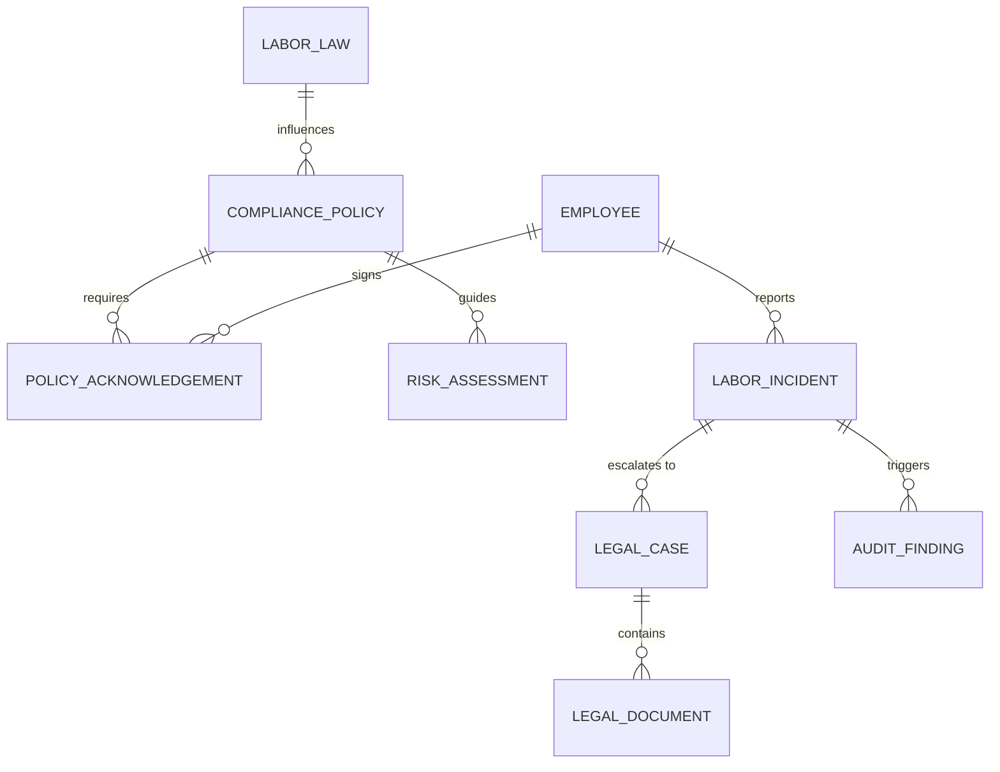

# Conceptual ERD — Compliance and Labor Law Management System

## Mermaid Code

## Entity Description Table | Bang mo ta Entity

| # | Entity Name | Vietnamese Name | Description | Key Attributes | Main Relationships |
|---|-------------|-----------------|-------------|----------------|-------------------|
| 1 | COMPLIANCE_POLICY | Chinh sach tuan thu | Quy dinh cua cong ty ve tuan thu | policy_id, title, version | requires POLICY_ACKNOWLEDGEMENT |
| 2 | POLICY_ACKNOWLEDGEMENT | Xac nhan chinh sach | Phieu xac nhan da doc va hieu | ack_id, date, status | belongs to EMPLOYEE |
| 3 | RISK_ASSESSMENT | Danh gia rui ro | Ho so danh gia rui ro tuan thu | risk_id, level, description | belongs to COMPLIANCE_POLICY |
| 4 | LABOR_LAW | Luat lao dong | Thong tin dao luat hoac nghi dinh | law_id, name, effective_date | influences COMPLIANCE_POLICY |
| 5 | EMPLOYEE | Nhan vien | Ho so nguoi lao dong | employee_id, name, department | reports LABOR_INCIDENT |
| 6 | LABOR_INCIDENT | Su co lao dong | Ghi nhan vi pham hoac tranh chap | incident_id, date, severity | triggers AUDIT_FINDING |
| 7 | LEGAL_CASE | Ho so phap ly | Vu kien hoac xu ly vi pham phap ly | case_id, status, resolution | contains LEGAL_DOCUMENT |
| 8 | AUDIT_FINDING | Ket qua kiem toan | Ghi nhan vi pham tu kiem toan | audit_id, finding_details | belongs to LABOR_INCIDENT |
| 9 | LEGAL_DOCUMENT | Tai lieu phap ly | Chung tu, van ban phap ly cho vu viec | document_id, type, file_path | belongs to LEGAL_CASE |

## Relationship Description | Mo ta Quan he

| # | From Entity | Cardinality | To Entity | Relationship Label | Business Explanation |
|---|-------------|-------------|-----------|-------------------|----------------------|
| 1 | COMPLIANCE_POLICY | one-to-many | POLICY_ACKNOWLEDGEMENT | requires | Mot chinh sach yeu cau nhieu xac nhan tu nhan vien. |
| 2 | COMPLIANCE_POLICY | one-to-many | RISK_ASSESSMENT | guides | Mot chinh sach co the huong dan nhieu danh gia rui ro. |
| 3 | LABOR_LAW | one-to-many | COMPLIANCE_POLICY | influences | Mot dieu luat co the anh huong nhieu chinh sach noi bo. |
| 4 | EMPLOYEE | one-to-many | POLICY_ACKNOWLEDGEMENT | signs | Mot nhan vien ky xac nhan nhieu chinh sach. |
| 5 | EMPLOYEE | one-to-many | LABOR_INCIDENT | reports | Mot nhan vien co the bao cao nhieu su co lao dong. |
| 6 | LABOR_INCIDENT | one-to-many | LEGAL_CASE | escalates to | Mot su co co the dan den nhieu ho so phap ly neu phuc tap. |
| 7 | LABOR_INCIDENT | one-to-many | AUDIT_FINDING | triggers | Mot su co co the gay ra nhieu ket qua kiem toan. |
| 8 | LEGAL_CASE | one-to-many | LEGAL_DOCUMENT | contains | Mot vu viec phap ly bao gom nhieu tai lieu. |
