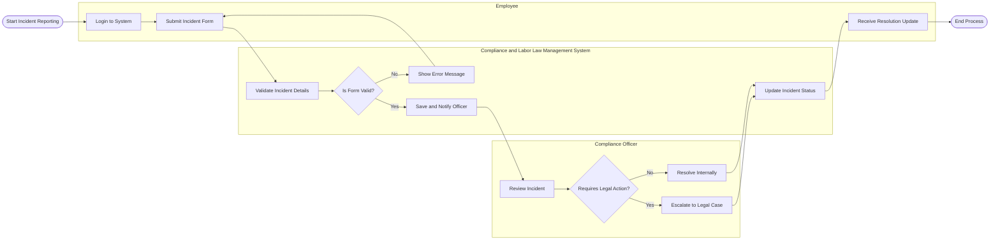

# Swimlane Diagram — Compliance and Labor Law Management System

## Mermaid Code

## Flow Description | Mo ta luong

| Lane | Actor | Role in Flow |
|------|-------|-------------|
| 1 | Employee | Nguoi chu dong bao cao su co lao dong va nhan phan hoi ket qua. |
| 2 | Compliance and Labor Law Management System | He thong kiem tra du lieu, luu tru bao cao, cap nhat trang thai va dieu phoi thong bao. |
| 3 | Compliance Officer | Nguoi tiep nhan, danh gia muc do vi pham va quyet dinh huong xu ly (noi bo hoac phap ly). |
