# Action Tree — Compliance and Labor Law Management System

## Mermaid Code

```mermaid
%%{init: {'theme': 'default'}}%%
graph TD
    Root["Compliance and Labor Law Management System"]

    Root --> M1["Policy Management"]
    Root --> M2["Incident Management"]
    Root --> M3["Audit & Risk Management"]
    Root --> M4["Legal Case Management"]
    Root --> M5["Regulatory Reporting"]

    M1 --> A11["Create Policy"]
    M1 --> A12["Update Policy"]
    M1 --> A13["Track Acknowledgements"]
    M1 --> A14["Archive Old Policies"]

    M2 --> A21["Report Incident"]
    M2 --> A22["Investigate Incident"]
    M2 --> A23["Resolve Incident"]

    M3 --> A31["Conduct Risk Assessment"]
    M3 --> A32["Log Audit Findings"]
    M3 --> A33["Track Remediation"]

    M4 --> A41["Open Legal Case"]
    M4 --> A42["Upload Legal Documents"]
    M4 --> A43["Update Case Status"]

    M5 --> A51["Generate Ministry Report"]
    M5 --> A52["Export Compliance Data"]
    M5 --> A53["Schedule Auto-reports"]
```

## Module Description | Mo ta Module

| # | Module | Description | Actions |
|---|--------|-------------|---------|
| 1 | Policy Management | Quan ly vong doi cac chinh sach tuan thu cua cong ty | Create Policy, Update Policy, Track Acknowledgements, Archive Old Policies |
| 2 | Incident Management | Ghi nhan va xu ly cac su co, vi pham lao dong | Report Incident, Investigate Incident, Resolve Incident |
| 3 | Audit & Risk Management | Danh gia rui ro va luu vet cac dot kiem toan | Conduct Risk Assessment, Log Audit Findings, Track Remediation |
| 4 | Legal Case Management | Theo doi tien do cac vu viec phap ly, tranh chap | Open Legal Case, Upload Legal Documents, Update Case Status |
| 5 | Regulatory Reporting | Tao bao cao gui co quan nha nuoc va quan tri | Generate Ministry Report, Export Compliance Data, Schedule Auto-reports |
