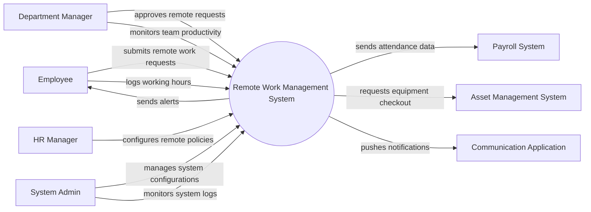

# Context Diagram — Remote Work Management System

## Mermaid Code

## Actor & Interaction Table | Bang Actor & Tuong tac

| # | Actor | Actor Type | Data Sent TO System | Data Received FROM System | Notes |
|---|-------|------------|---------------------|---------------------------|-------|
| 1 | Employee | Primary | Remote work requests, time logs, equipment requests | Status updates, alerts | Nhan vien lam viec tu xa |
| 2 | Department Manager | Primary | Request approvals, team reviews | Team productivity reports | Quan ly bo phan |
| 3 | HR Manager | Primary | Remote work policies | Compliance reports | Quan tri vien nhan su |
| 4 | System Admin | Primary | System configurations, user roles | System logs, error alerts | Quan tri he thong |
| 5 | Payroll System | Supporting | Payroll processing status | Time tracking and attendance data | He thong tinh luong |
| 6 | Asset Management System | Supporting | Equipment availability status | Equipment checkout requests | He thong quan ly tai san |
| 7 | Communication Application | Supporting | User presence status | Automated system notifications | Ung dung giao tiep |

## System Boundary Description | Mo ta Pham vi He thong

The Remote Work Management System handles scheduling, productivity tracking, and policy compliance for remote employees. It allows employees to request remote work days and request necessary home office equipment, while managers can track attendance and approve requests. The system relies on the Asset Management System for physical equipment inventory and the Payroll System for processing compensation based on logged remote hours.
