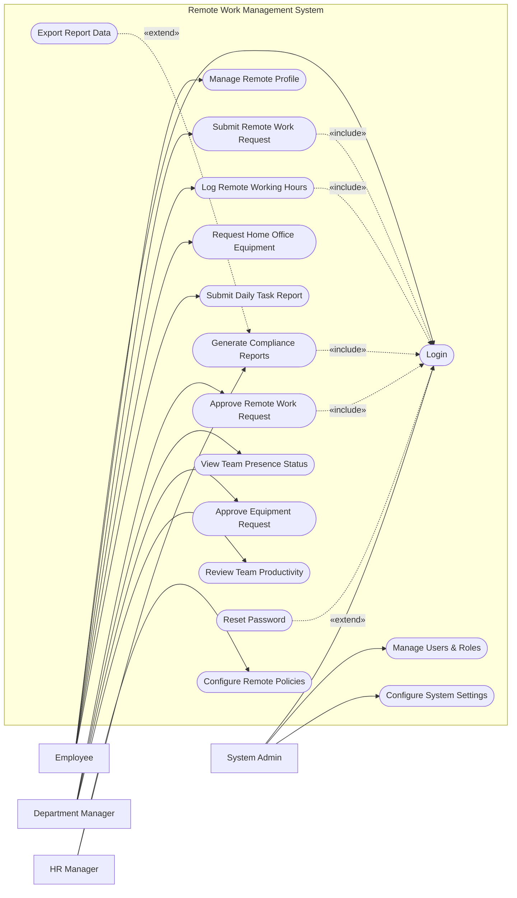

# Use Case Diagram — Remote Work Management System

## Mermaid Code

## Actor Table | Bang Actor

| # | Actor | Actor Type | Role Description | Related Use Cases |
|---|-------|------------|------------------|-------------------|
| 1 | Employee | Primary | Nhan vien thong thuong lam viec tu xa | UC01, UC02, UC03, UC05, UC07, UC09 |
| 2 | Department Manager | Primary | Quan ly theo doi tien do va duyet don tu xa | UC04, UC06, UC08, UC10 |
| 3 | HR Manager | Primary | Nhan su thiet lap chinh sach lam viec tu xa | UC11, UC12 |
| 4 | System Admin | Primary | Quan tri vien he thong | UC01, UC15, UC16 |

## Use Case Table | Bang Use Case

| # | UC ID | Use Case Name | Primary Actor | Secondary Actor | Description | Priority |
|---|-------|---------------|---------------|-----------------|-------------|----------|
| 1 | UC01 | Login | Employee | | Authenticate user access | High |
| 2 | UC02 | Manage Remote Profile | Employee | | Update home address and contact details | Medium |
| 3 | UC03 | Submit Remote Work Request | Employee | | Request days for remote work | High |
| 4 | UC04 | Approve Remote Work Request| Department Manager | | Review and approve remote work requests | High |
| 5 | UC05 | Log Remote Working Hours | Employee | | Log start and end times for remote work | High |
| 6 | UC06 | View Team Presence Status | Department Manager | | Check who is currently online | Low |
| 7 | UC07 | Request Home Office Equipment | Employee | Asset System | Request laptops, monitors for remote work | Medium |
| 8 | UC08 | Approve Equipment Request | Department Manager | | Approve requested equipment | Medium |
| 9 | UC09 | Submit Daily Task Report | Employee | | Log tasks completed during the remote day | Medium |
| 10| UC10 | Review Team Productivity | Department Manager | | Check daily task reports from the team | Medium |
| 11| UC11 | Configure Remote Policies | HR Manager | | Set max remote days allowed per month | High |
| 12| UC12 | Generate Compliance Reports | HR Manager | | Check compliance with remote policies | Medium |
| 13| UC13 | Reset Password | Employee | | Recover forgotten account password | High |
| 14| UC14 | Export Report Data | HR Manager | | Download compliance reports | Low |
| 15| UC15 | Manage Users & Roles | System Admin | | Manage user accounts and permissions | High |
| 16| UC16 | Configure System Settings | System Admin | | Configure global system parameters | High |

## Use Case Specification | Dac ta Use Case

---

### UC01 — Login

| Field | Detail |
|-------|--------|
| **UC ID** | UC01 |
| **Use Case Name** | Login |
| **Actor(s)** | Primary: Employee, Department Manager, HR Manager, System Admin |
| **Description** | Cho phep nguoi dung xac thuc de truy cap he thong quan ly lam viec tu xa. |
| **Precondition** | 1. Nguoi dung co tai khoan hop le.  2. He thong dang hoat dong binh thuong. |
| **Main Flow** | 1. Actor truy cap trang dang nhap.  2. System hien thi form dang nhap.  3. Actor nhap username va password.  4. Actor nhan Submit.  5. System xac thuc thong tin.  6. System chuyen huong vao dashboard. |
| **Alternative Flow** | **AF1** — Quen mat khau: Neu Actor chon "Forgot Password", System kich hoat UC13. |
| **Exception Flow** | **EX1** — Sai thong tin: Neu xac thuc that bai, System hien thi loi "Invalid credentials".  **EX2** — Tai khoan bi khoa: Neu nhap sai 5 lan, tai khoan bi khoa. |
| **Postcondition** | Phien lam viec cua nguoi dung duoc tao thanh cong. |
| **Business Rule** | **BR1**: Mat khau phai ma hoa.  **BR2**: Timeout phien sau 30 phut. |

---

### UC03 — Submit Remote Work Request

| Field | Detail |
|-------|--------|
| **UC ID** | UC03 |
| **Use Case Name** | Submit Remote Work Request |
| **Actor(s)** | Primary: Employee |
| **Description** | Nhan vien nop don yeu cau duoc lam viec tu xa cho cac ngay cu thu. |
| **Precondition** | 1. Nhan vien da dang nhap (Include UC01).  2. Nhan vien chua vuot qua so ngay lam tu xa toi da trong thang. |
| **Main Flow** | 1. Actor vao muc "Remote Requests".  2. System hien thi form va so ngay con lai.  3. Actor chon ngay va nhap ly do.  4. Actor nhan Submit.  5. System kiem tra tinh hop le.  6. System luu don (Pending) va gui thong bao cho Manager. |
| **Alternative Flow** | **AF1** — Huy don: Truoc buoc 4, Actor chon Cancel. |
| **Exception Flow** | **EX1** — Vuot qua han muc: Neu so ngay chon vuot qua so ngay cho phep, System bao loi.  **EX2** — Trung ngay: Neu da co don cho ngay nay, System bao loi. |
| **Postcondition** | Don duoc luu voi trang thai Pending. |
| **Business Rule** | **BR1**: Nhan vien chi duoc phep chon toi da 5 ngay lien tiep.  **BR2**: Phai nop don truoc it nhat 1 ngay. |

---

### UC04 — Approve Remote Work Request

| Field | Detail |
|-------|--------|
| **UC ID** | UC04 |
| **Use Case Name** | Approve Remote Work Request |
| **Actor(s)** | Primary: Department Manager |
| **Description** | Quan ly xem xet va phe duyet/tu choi yeu cau lam tu xa cua nhan vien. |
| **Precondition** | 1. Manager da dang nhap.  2. Co don dang cho xet duyet (Pending). |
| **Main Flow** | 1. Actor mo danh sach don can duyet.  2. System hien thi cac don Pending.  3. Actor chon xem chi tiet mot don.  4. System hien thi thong tin va lich cua team.  5. Actor nhan Approve.  6. System cap nhat trang thai, gui email cho nhan vien. |
| **Alternative Flow** | **AF1** — Tu choi: O buoc 5, Actor nhan Reject va nhap ly do. System cap nhat thanh Rejected. |
| **Exception Flow** | **EX1** — Don da xu ly: Neu don da bi huy boi nhan vien truoc do, System bao loi. |
| **Postcondition** | Don duoc chuyen sang Approved hoac Rejected. |
| **Business Rule** | **BR1**: Manager phai nhap ly do neu tu choi.  **BR2**: Chi duyet don cua nhan vien thuoc team minh. |

---

### UC05 — Log Remote Working Hours

| Field | Detail |
|-------|--------|
| **UC ID** | UC05 |
| **Use Case Name** | Log Remote Working Hours |
| **Actor(s)** | Primary: Employee |
| **Description** | Nhan vien lam tu xa tien hanh check-in, check-out tren he thong. |
| **Precondition** | 1. Nhan vien da dang nhap.  2. Hom nay la ngay lam viec tu xa da duoc duyet. |
| **Main Flow** | 1. Actor truy cap man hinh Time Tracker.  2. System hien thi dong ho va nut Check-in.  3. Actor nhan Check-in.  4. System luu gio Check-in va bat dau dem thoi gian.  5. Actor nhan Check-out khi ket thuc.  6. System luu gio Check-out va tinh tong thoi gian. |
| **Alternative Flow** | **AF1** — Ghi nhan gio vao muon: System tu dong gui bao cao muon cho Manager neu check-in sau 9:00 AM. |
| **Exception Flow** | **EX1** — Chua duyet don: Neu ngay hien tai khong co don Approved, System chan chuc nang Check-in.  **EX2** — Quen Check-out: System tu dong check-out tai thoi diem 11:59 PM va danh dau "Auto-checkout". |
| **Postcondition** | Thoi gian lam viec trong ngay duoc luu tru chinh xac. |
| **Business Rule** | **BR1**: Tong so gio lam viec trong ngay phai duoc ghi nhan de tra luong.  **BR2**: Yeu cau xac thuc dia chi IP hoac GPS khi check-in. |
