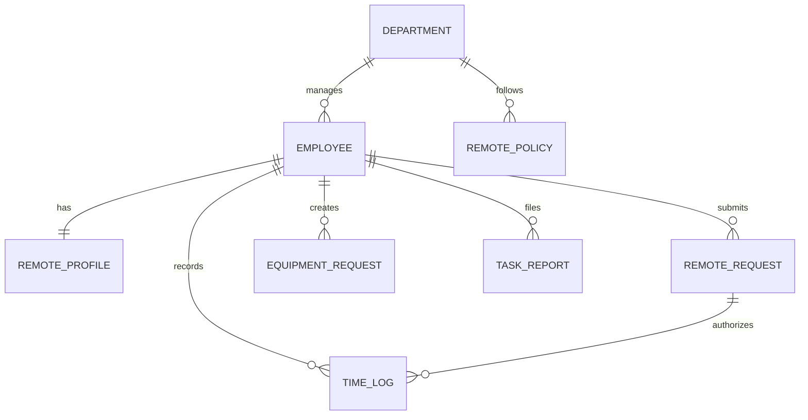

# Conceptual ERD — Remote Work Management System

## Mermaid Code

## Entity Description Table | Bang mo ta Entity

| # | Entity Name | Vietnamese Name | Description | Key Attributes | Main Relationships |
|---|-------------|-----------------|-------------|----------------|-------------------|
| 1 | DEPARTMENT | Phong ban | Thong tin cac phong ban | department_id, name | manages EMPLOYEE |
| 2 | EMPLOYEE | Nhan vien | Ho so nhan vien | employee_id, name, email | submits REMOTE_REQUEST |
| 3 | REMOTE_PROFILE | Ho so tu xa | Thong tin dia chi va IP lam viec | profile_id, home_address, network_ip | belongs to EMPLOYEE |
| 4 | REMOTE_REQUEST | Yeu cau tu xa | Don xin lam viec tu xa | request_id, start_date, status | belongs to EMPLOYEE |
| 5 | TIME_LOG | Nhat ky thoi gian | Ban ghi check-in, check-out | log_id, check_in, check_out | belongs to EMPLOYEE |
| 6 | EQUIPMENT_REQUEST | Yeu cau thiet bi | Don muon thiet bi ve nha | eq_req_id, items, status | belongs to EMPLOYEE |
| 7 | TASK_REPORT | Bao cao cong viec | Bao cao cong viec hang ngay | report_id, task_summary, hours | belongs to EMPLOYEE |
| 8 | REMOTE_POLICY | Chinh sach tu xa | Quy dinh so ngay duoc lam tu xa | policy_id, max_days, rules | applies to DEPARTMENT |

## Relationship Description | Mo ta Quan he

| # | From Entity | Cardinality | To Entity | Relationship Label | Business Explanation |
|---|-------------|-------------|-----------|-------------------|----------------------|
| 1 | DEPARTMENT | one-to-many | EMPLOYEE | manages | Mot phong ban quan ly nhieu nhan vien. |
| 2 | EMPLOYEE | one-to-one | REMOTE_PROFILE | has | Mot nhan vien co mot ho so lam viec tu xa. |
| 3 | EMPLOYEE | one-to-many | REMOTE_REQUEST | submits | Mot nhan vien co the nop nhieu don lam tu xa. |
| 4 | EMPLOYEE | one-to-many | TIME_LOG | records | Mot nhan vien sinh ra nhieu ban ghi thoi gian. |
| 5 | EMPLOYEE | one-to-many | EQUIPMENT_REQUEST | creates | Mot nhan vien co the muon nhieu thiet bi. |
| 6 | EMPLOYEE | one-to-many | TASK_REPORT | files | Mot nhan vien gui nhieu bao cao cong viec. |
| 7 | DEPARTMENT | one-to-many | REMOTE_POLICY | follows | Mot phong ban tuan theo cac chinh sach rieng. |
| 8 | REMOTE_REQUEST | one-to-many | TIME_LOG | authorizes | Mot don duyet phep ghi nhan nhieu ngay check-in. |
